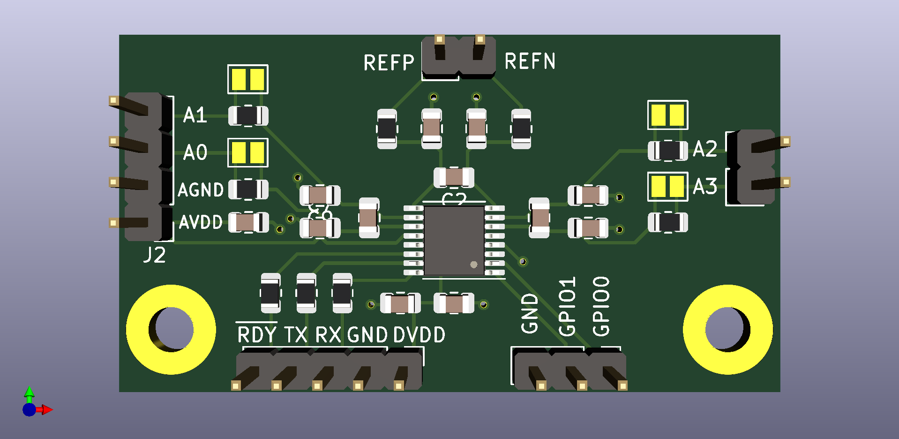

# DS2 Addon

The **DS2 Addon** is a piggyback board for the **DS2 force gauge**. It conditions
the strain-gauge signal and presents an analog voltage that the firmware reads
through the **ADS122U04** ADC, giving the machine its force measurement.

## Role in the machine

- Interfaces the DS2 force gauge's strain-gauge bridge to the
  [EdgeBoard](../EdgeBoard/readme.md).
- Feeds the analog force signal to the ADS122U04 ADC (driven by `IO_ADS122U04`
  in the [firmware](../../Firmware/MaDCore)).
- Provides the force-path measurement used for live readouts, limit enforcement,
  and stress calculation.

## Working with the design

This is a [KiCad](https://www.kicad.org/) project (under `KICAD/`). Open the
`.kicad_pro` to view or edit it. Manufacturing files are produced by the hardware
CI job and published on `hardware-v*` tags — see the
[CI/CD docs](https://rileymccarthy.github.io/MaD/dev/ci-cd-and-releases/).

## Documentation

See the
[Hardware overview](https://rileymccarthy.github.io/MaD/how-it-works/hardware/)
for how the force path works end-to-end.

> **Status:** schematic notes and a bill of materials are still being written.
