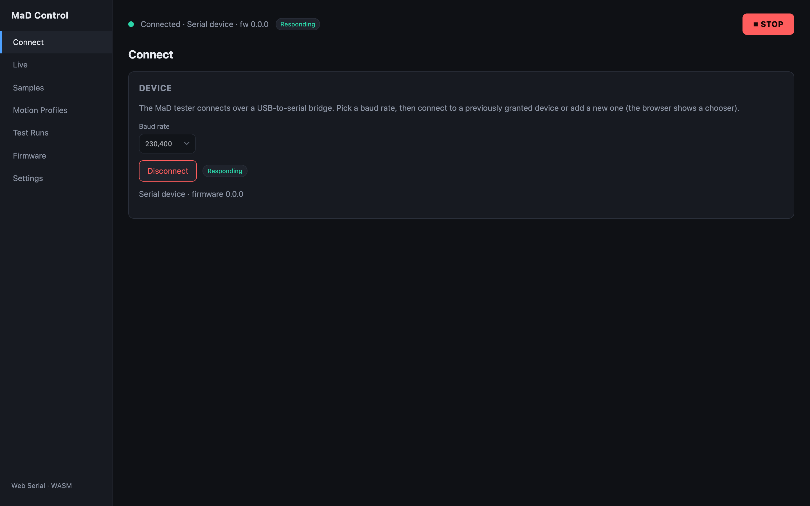

# For operators — your first test

This is a guided walkthrough for someone with a MaD machine who wants to connect
and run a test for the first time. It uses the browser control app — there is
nothing to install.

!!! tip "Just exploring?"
    You can open the app and click through every screen without a machine
    connected. To see live data and run tests you'll need a MaD machine (or the
    [SIL emulator](../dev/sil-testing.md), which is how the screenshots below were
    produced).

## 1. Open the app

In **Chrome or Edge**, go to:

**<https://rileymccarthy.github.io/MaD/app/>**

If you see an "unsupported browser" message, you are not in a Chromium browser —
see [requirements](requirements.md).

## 2. Power on and connect

1. Power the machine on (see the
   [power-up sequence](../how-it-works/the-machine.md#power-up-sequence)) and
   connect it to your computer over USB.
2. In the app, open **Connect** in the sidebar.
3. Leave the **baud rate** at the default (**230400**) and click **Connect
   device**. Your browser shows a serial-port chooser — pick the machine's port.

When connected, the status bar turns green and shows **Connected** with a
**Responding** badge once the firmware starts streaming data:

[:octicons-arrow-right-24: More on connecting](../user-guide/connecting.md)

## 3. Watch live data

Open **Live**. You'll see real-time readouts (machine and sample force/position),
the machine **state** (faults, restrictions, motion, test), manual **controls**,
and a live **force & position** chart:

To move the gantry by hand, click **Enable motion**, set a jog distance and
speed, and use **+ Jog up** / **− Jog down**. You can also **Home**, **Zero
force**, and **Zero length** here.

[:octicons-arrow-right-24: Live monitoring](../user-guide/live-monitoring.md) ·
[Manual control](../user-guide/manual-control.md)

## 4. Set up a test

A test combines two things:

1. A **sample profile** — your material's dimensions and safety limits
   (max force, max displacement, width, thickness). Create it on the **Samples**
   screen. [:octicons-arrow-right-24: Sample profiles](../user-guide/sample-profiles.md)
2. A **motion profile** — what the machine should *do*: a sequence of moves
   (linear pulls, dwells, cyclic waveforms) grouped into repeatable sets. Build it
   on the **Motion Profiles** screen.
   [:octicons-arrow-right-24: Motion profiles](../user-guide/motion-profiles.md)

!!! note "Choose a data folder first"
    On the **Settings** screen, click **Choose folder** and pick a folder on your
    computer. Profiles and results are saved there. You only do this once.
    [:octicons-arrow-right-24: Settings & data](../user-guide/settings-and-data.md)

## 5. Run it

Open **Test Runs**. In the **New Test** card, pick your saved sample and motion
profiles, optionally **Preview G-code**, then click **Run Test**. The run appears
in the **History** table and updates to *completed* on its own when the machine
finishes:

!!! warning "The machine is the safety authority"
    MaD runs tests **autonomously from its SD card** and is protected by its own
    **hardware e-stop and sensors**. Closing the browser tab or losing the USB
    link does **not** stop a running test — the app simply reconnects to keep
    monitoring it. The red **STOP** button in the app is a convenience that
    disables motion; it is *not* a substitute for the hardware e-stop.

## 6. Review the results

Back in **Test Runs**, click **Download data** on a finished run to pull the CSV
off the machine, then **View** to see the analysis — force vs time, position
(actual / setpoint / expected), and a stress–strain curve:

[:octicons-arrow-right-24: Test history & analysis](../user-guide/test-history-and-analysis.md)

---

That's the full loop: **connect → profile → run → analyse**. The
[User Guide](../user-guide/index.md) covers every screen in detail.
