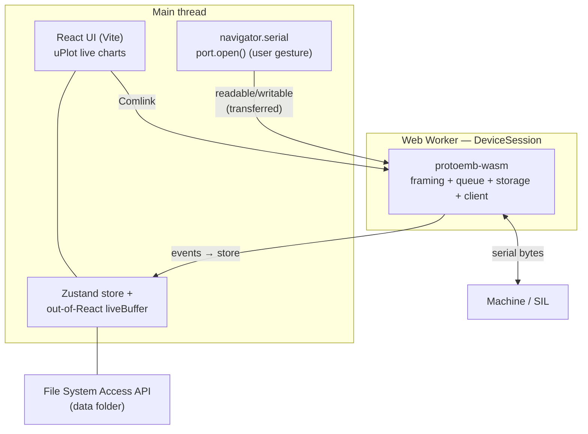

# The control app

[**Control**](https://rileymccarthy.github.io/MaD/app/) is a frontend-only
control app with **no backend**: the browser talks straight to the Propeller 2
over the **Web Serial API**, and all the protocol logic runs as **WebAssembly**
compiled from the same Rust core (`Protocol/ProtoEmb/runtime`) used by the
firmware tooling and the SIL rig. It lives in `Software/Control/`.

## Architecture

The serial read loop and **all** protocol work run in a dedicated **Web Worker**,
so the ~100 Hz sample stream never blocks rendering. The port is opened on the
main thread (Web Serial requires a user gesture) and its readable/writable streams
are **transferred** to the worker.

## Source layout

| Path | What |
|---|---|
| `src/protocol/generated/` | Generated TypeScript codec (browser-safe `Uint8Array`/`DataView`) |
| `src/wasm/` | `wasm-pack` output of the Rust protocol client |
| `src/domain/` | Pure logic (G-code build/transform, sample→CSV, proto↔display mapping) |
| `src/device/` | `DeviceSession.worker.ts` (worker) + `session.ts` (main-thread client) |
| `src/storage/` | `DataStore` over the File System Access API |
| `src/store/` | Zustand store + out-of-React `liveBuffer` |
| `src/ui/` | Screens + uPlot live charts |

`src/wasm/` and `src/protocol/generated/` are **git-ignored build artifacts** —
they're produced by `build:wasm` and `generate:proto` (see
[running the app](../dev/running-the-app.md)).

## Reliability by design

The app is a **monitor/controller, not a safety device** (see the
[safety model](the-machine.md#safety-model)). Around that principle it adds:

- **Move validation** before any motion is sent — out-of-range X/F/P and unknown
  G-codes are rejected on the wire (the packed codec would otherwise silently
  bit-wrap an over-range value).
- **Crash recovery** — React error boundaries (top-level + per-screen) and a fresh
  worker per connection, so a render throw or a panicked WASM instance can't blank
  the app or carry over.
- **Resilient teardown / reconnect** — stream death is detected in the worker;
  the app surfaces a Reconnect and auto-reconnects on replug.
- **Durable storage** — all mutating data-folder operations are serialised through
  one mutex, and `index.json` is a rebuildable cache.
- **Deferred PWA updates** — a new version is applied only when idle and
  disconnected, never mid-test.

For the full hardening write-up see
[HARDENING.md](https://github.com/RileyMcCarthy/MaD/blob/main/Software/Control/docs/HARDENING.md).

## Performance

A few choices keep the UI smooth at 100 Hz: an **O(1) ring buffer** for live
samples (no per-sample memmove), **idle-redraw gating** on the charts (no canvas
work without new data), zero-copy `Uint8Array` marshalling across the WASM
boundary, and route code-splitting for a lean initial bundle.

## Not included

- **Firmware flashing** — the native `loadp2` bootloader can't run in a browser;
  use the desktop tooling.
- **Non-Chromium browsers** — Web Serial / File System Access are Chromium-only.
