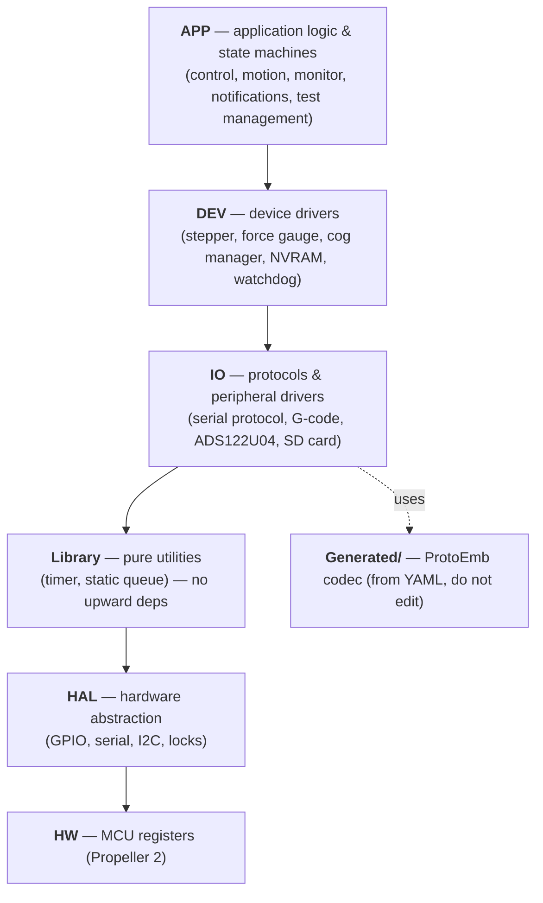

# Firmware

The firmware runs on a **Parallax Propeller 2** and is written in C, compiled
with the FlexC compiler via PlatformIO. It lives in `Firmware/MaDCore/`.

## Layered architecture

The firmware uses a **strict layered architecture**: each layer may only call the
layer directly below it.

This separation is enforced by convention and by `pio check` (MISRA C:2023 +
CERT). APP/DEV/IO never include low-level MCU headers — they go through the HAL.

Files are prefixed with their layer (`app_control.c`, `dev_stepper.c`,
`IO_protocol.c`, `lib_timer.c`), and configuration lives in `Config/` subfolders.

## Multi-core (COGs)

The Propeller 2 has **8 independent cores ("cogs")**. `dev_cogManager` allocates
tasks across them on named **channels**, with stack-canary protection and
watchdog integration. The channels (`DEV/Config/dev_cogManager_config.h` /
`.c`):

| Channel | Task | Loop rate |
|---|---|---|
| `MONITOR` | Data aggregation, limit checks, watchdog, SD card (also hosts the cog manager) | 1 kHz |
| `MOTOR` | Motion planning + stepper pulse generation | free-running |
| `COMMUNICATION` | Protocol messages + notifications | 100 Hz |
| `CONTROL` | Control state machine (test-management → motion → control) | 1 kHz |
| `LOGGER` | Test-data logging | 1 kHz |
| `FORCEGAUGE` | Force-gauge ADC sampling (ADS122U04) | free-running |
| `SERIAL` | Full-duplex serial I/O | free-running |

(A *free-running* channel — `0 Hz` in the config — loops as fast as it can rather
than at a fixed rate.) Channels are declared in
`DEV/Config/dev_cogManager_config.h` using the
`DEV_COGMANAGER_CHANNEL_CREATE_INIT/RUN` macros.

!!! note "Locking discipline"
    HAL locks are **not reentrant**, and a module must **never call another
    module's API while holding its own lock** — this prevents both self-deadlock
    and cross-cog ABBA deadlocks. `Library` data structures (e.g. the static
    queue) are unsynchronised by contract; the owning module wraps them in its own
    lock when its topology needs one (lock-free for single-producer/consumer use).

## The control state machine

`app_control` owns the machine state (`DISABLED → RESTRICTED → MANUAL → TEST`)
and gates all motion through `app_control_motionEnabled()`. See
[the machine](the-machine.md#the-state-machine) for the diagram and
[the reference](../reference/machine-states.md) for the full fault/restriction
list.

- **Faults** latch and (generally) require a reboot: cog failure, watchdog
  timeout, ESD power/switch/upper/lower, servo or force-gauge communication loss.
- **Restrictions** clear automatically when resolved: sample/machine tension,
  sample length, upper/lower endstop, door interlock.

## Tests run from SD

When a test starts, the app has already uploaded the compiled **G-code** to the
machine's SD card. The firmware then plays the program back line-by-line
(`IO_gcode` + `app_motion`), so the test runs **without the host** — the basis of
the [safety model](the-machine.md#safety-model). Completion is signalled by the
trailing **`G122`**.

## Build targets

The firmware builds for hardware and for the host-side test rig:

| PlatformIO environment | Purpose |
|---|---|
| `propeller2` | Production hardware build (FlexC) |
| `propeller2_debug` | Hardware build with debug serial |
| `native_emulator` | Compiles the firmware as `libfirmware.a` (gcc) for the [SIL emulator](sil-emulator.md) |
| `native_test` | Unity unit tests (native gcc) |

The `native_emulator` build excludes the `HAL/` and `HW/` layers (the emulator
supplies its own HAL) and `Main/main.c` (the emulator calls `mad_begin()`
directly). See [Building the firmware](../dev/building-firmware.md).
