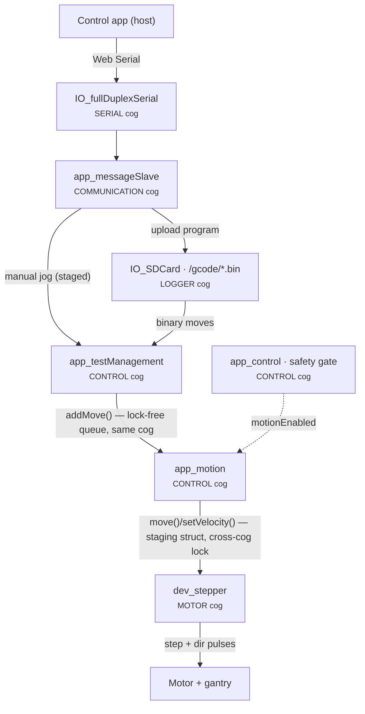
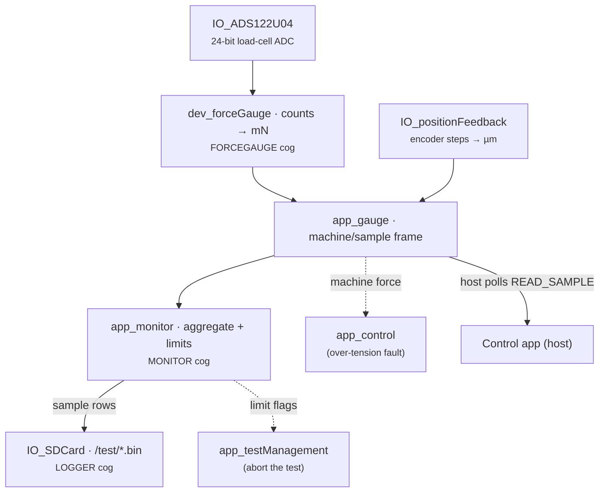
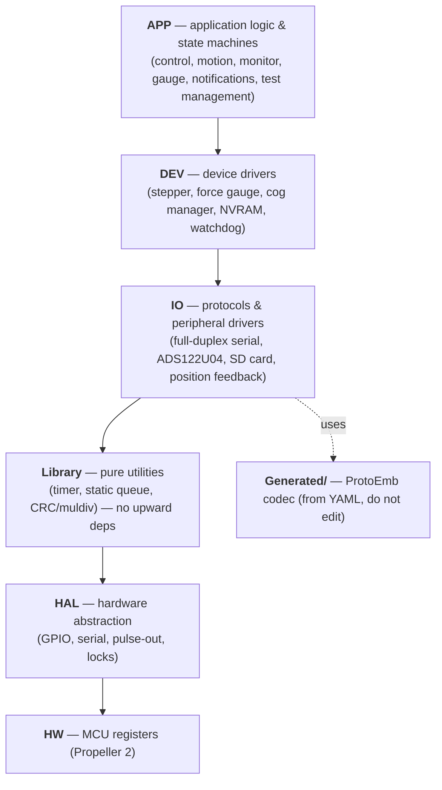

# Firmware

The firmware runs on a **Parallax Propeller 2** and is written in C, compiled
with the FlexC compiler via PlatformIO. It lives in `Firmware/MaDCore/`.

It is built from ~20 small modules, each prefixed with its layer
(`app_control.c`, `dev_stepper.c`, `IO_protocol.c`, `lib_timer.c`). The map below
is the fastest way to see how they fit together — and how a test flows from the
host all the way down to a motor pulse.

## How the modules fit together

Two data paths run through the firmware in opposite directions:

- a **command / motion path** (teal) carries a test or a manual jog *down* from
  the host to the motor, and
- a **sensor-feedback path** (amber) carries force and position *up* from the
  load cell back to the log and the host.

**Hover (or keyboard-tab) over any module** to see what it does and which of the
eight cores it runs on. The ★ edges are the spine this page is really about:
`app_testManagement` feeds `app_motion`, which feeds `dev_stepper`.

<svg viewBox="0 0 1200 690" role="group" aria-label="MaD firmware module interaction map" xmlns="http://www.w3.org/2000/svg">
  <defs>
    <marker id="fw-arrow-cmd" markerWidth="7" markerHeight="7" refX="5.5" refY="3" orient="auto"><path class="fw-arrow--cmd" d="M0 0 L6 3 L0 6 z"/></marker>
    <marker id="fw-arrow-fb" markerWidth="7" markerHeight="7" refX="5.5" refY="3" orient="auto"><path class="fw-arrow--fb" d="M0 0 L6 3 L0 6 z"/></marker>
    <marker id="fw-arrow-aux" markerWidth="7" markerHeight="7" refX="5.5" refY="3" orient="auto"><path class="fw-arrow--aux" d="M0 0 L6 3 L0 6 z"/></marker>
  </defs>
  <path class="fw-edge fw-edge--cmd" d="M600.0 67.0 L600.0 89.0" marker-end="url(#fw-arrow-cmd)"/>
  <path class="fw-edge fw-edge--cmd" d="M600.0 139.0 L600.0 165.0" marker-end="url(#fw-arrow-cmd)"/>
  <path class="fw-edge fw-edge--cmd" d="M600.0 215.0 L600.0 243.0" marker-end="url(#fw-arrow-cmd)"/>
  <path class="fw-edge fw-edge--cmd" d="M515.0 270.0 L443.7 298.5" marker-end="url(#fw-arrow-cmd)"/>
  <path class="fw-edge fw-edge--cmd" d="M600.0 215.0 L343.9 276.1" marker-end="url(#fw-arrow-cmd)"/>
  <path class="fw-edge fw-edge--cmd" d="M340.0 323.0 L340.0 365.0" marker-end="url(#fw-arrow-cmd)"/>
  <path class="fw-edge fw-edge--cmd" d="M340.0 415.0 L340.0 455.0" marker-end="url(#fw-arrow-cmd)"/>
  <path class="fw-edge fw-edge--cmd" d="M340.0 505.0 L340.0 539.0" marker-end="url(#fw-arrow-cmd)"/>
  <path class="fw-edge fw-edge--fb" d="M860.0 543.0 L860.0 509.0" marker-end="url(#fw-arrow-fb)"/>
  <path class="fw-edge fw-edge--fb" d="M860.0 459.0 L860.0 419.0" marker-end="url(#fw-arrow-fb)"/>
  <path class="fw-edge fw-edge--fb" d="M860.0 369.0 L860.0 327.0" marker-end="url(#fw-arrow-fb)"/>
  <path class="fw-edge fw-edge--fb" d="M760.0 300.0 L688.7 271.5" marker-end="url(#fw-arrow-fb)"/>
  <path class="fw-edge fw-edge--fb" d="M965.0 388.0 L1010.0 388.0 L1010.0 150.0 L803.9 191.2" stroke-dasharray="5 5" marker-end="url(#fw-arrow-fb)"/>
  <path class="fw-edge fw-edge--aux" d="M515.0 362.0 L443.7 390.5" stroke-dasharray="5 5" marker-end="url(#fw-arrow-aux)"/>
  <path class="fw-edge fw-edge--aux" d="M760.0 392.0 L688.7 363.5" stroke-dasharray="5 5" marker-end="url(#fw-arrow-aux)"/>
  <path class="fw-edge fw-edge--aux" d="M760.0 300.0 L444.0 300.0" stroke-dasharray="5 5" marker-end="url(#fw-arrow-aux)"/>
  <g class="fw-node fw-node--hw" tabindex="0" role="img" aria-label="Control app (host): Uploads compiled tests, sends manual jogs, and polls live data over the ProtoEmb serial protocol. Never a safety authority.">
    <rect class="fw-node-box" x="380" y="21" width="440" height="46" rx="8"/>
    <text class="fw-node-label" x="600" y="38">Control app (host)</text><text class="fw-node-sub" x="600" y="55">off-machine · Web Serial</text>
    <title>Control app (host) — Uploads compiled tests, sends manual jogs, and polls live data over the ProtoEmb serial protocol. Never a safety authority.</title>
    <g class="fw-card"><rect class="fw-card-bg" x="8" y="8" width="232" height="117" rx="8"/><text class="fw-card-title" x="20" y="32">Control app (host)</text><text class="fw-card-meta" x="20" y="51">off-machine · Web Serial</text><text class="fw-card-body" x="20" y="67">Uploads compiled tests, sends manual</text><text class="fw-card-body" x="20" y="81">jogs, and polls live data over the</text><text class="fw-card-body" x="20" y="95">ProtoEmb serial protocol. Never a</text><text class="fw-card-body" x="20" y="109">safety authority.</text></g>
  </g>
  <g class="fw-node fw-node--cmd" tabindex="0" role="img" aria-label="IO_fullDuplexSerial: Buffered full-duplex UART. Queues outbound bytes and drains the hardware RX into per-channel software buffers for other cogs.">
    <rect class="fw-node-box" x="430" y="93" width="340" height="46" rx="8"/>
    <text class="fw-node-label" x="600" y="110">IO_fullDuplexSerial</text><text class="fw-node-sub" x="600" y="127">SERIAL cog · free-run</text>
    <title>IO_fullDuplexSerial — Buffered full-duplex UART. Queues outbound bytes and drains the hardware RX into per-channel software buffers for other cogs.</title>
    <g class="fw-card"><rect class="fw-card-bg" x="8" y="57.5" width="232" height="117" rx="8"/><text class="fw-card-title" x="20" y="81.5">IO_fullDuplexSerial</text><text class="fw-card-meta" x="20" y="100.5">SERIAL cog · free-run</text><text class="fw-card-body" x="20" y="116.5">Buffered full-duplex UART. Queues</text><text class="fw-card-body" x="20" y="130.5">outbound bytes and drains the hardware</text><text class="fw-card-body" x="20" y="144.5">RX into per-channel software buffers</text><text class="fw-card-body" x="20" y="158.5">for other cogs.</text></g>
  </g>
  <g class="fw-node fw-node--cmd" tabindex="0" role="img" aria-label="app_messageSlave: The host’s serial port: decodes incoming ProtoEmb messages and answers them by reading or writing the rest of the firmware — state, config, moves, samples. Uses the generated ProtoEmb codec; the older IO_protocol / IO_gcode parsers are off the runtime path.">
    <rect class="fw-node-box" x="400" y="169" width="400" height="46" rx="8"/>
    <text class="fw-node-label" x="600" y="186">app_messageSlave</text><text class="fw-node-sub" x="600" y="203">COMMUNICATION cog · 100 Hz</text>
    <title>app_messageSlave — The host’s serial port: decodes incoming ProtoEmb messages and answers them by reading or writing the rest of the firmware — state, config, moves, samples. Uses the generated ProtoEmb codec; the older IO_protocol / IO_gcode parsers are off the runtime path.</title>
    <g class="fw-card"><rect class="fw-card-bg" x="8" y="105.5" width="232" height="173" rx="8"/><text class="fw-card-title" x="20" y="129.5">app_messageSlave</text><text class="fw-card-meta" x="20" y="148.5">COMMUNICATION cog · 100 Hz</text><text class="fw-card-body" x="20" y="164.5">The host’s serial port: decodes</text><text class="fw-card-body" x="20" y="178.5">incoming ProtoEmb messages and answers</text><text class="fw-card-body" x="20" y="192.5">them by reading or writing the rest of</text><text class="fw-card-body" x="20" y="206.5">the firmware — state, config, moves,</text><text class="fw-card-body" x="20" y="220.5">samples. Uses the generated ProtoEmb</text><text class="fw-card-body" x="20" y="234.5">codec; the older IO_protocol /</text><text class="fw-card-body" x="20" y="248.5">IO_gcode parsers are off the runtime</text><text class="fw-card-body" x="20" y="262.5">path.</text></g>
  </g>
  <g class="fw-node fw-node--hub" tabindex="0" role="img" aria-label="IO_SDCard: Generic SD-channel system: streams packed C structs to/from files via per-channel queues. Holds the test program (binary moves) and the recorded sample log — so a test runs with the host unplugged.">
    <rect class="fw-node-box" x="515" y="247" width="170" height="46" rx="8"/>
    <text class="fw-node-label" x="600" y="264">IO_SDCard</text><text class="fw-node-sub" x="600" y="281">LOGGER cog · 1 kHz</text>
    <title>IO_SDCard — Generic SD-channel system: streams packed C structs to/from files via per-channel queues. Holds the test program (binary moves) and the recorded sample log — so a test runs with the host unplugged.</title>
    <g class="fw-card"><rect class="fw-card-bg" x="8" y="197.5" width="232" height="145" rx="8"/><text class="fw-card-title" x="20" y="221.5">IO_SDCard</text><text class="fw-card-meta" x="20" y="240.5">LOGGER cog · 1 kHz</text><text class="fw-card-body" x="20" y="256.5">Generic SD-channel system: streams</text><text class="fw-card-body" x="20" y="270.5">packed C structs to/from files via</text><text class="fw-card-body" x="20" y="284.5">per-channel queues. Holds the test</text><text class="fw-card-body" x="20" y="298.5">program (binary moves) and the</text><text class="fw-card-body" x="20" y="312.5">recorded sample log — so a test runs</text><text class="fw-card-body" x="20" y="326.5">with the host unplugged.</text></g>
  </g>
  <g class="fw-node fw-node--cmd" tabindex="0" role="img" aria-label="app_testManagement: Test-session lifecycle (IDLE → STARTING → RUNNING → ENDING). Replays the SD test program into the motion queue and gates manual jogs; ends the test on G122 / EOF, a sample limit, or a stop request.">
    <rect class="fw-node-box" x="240" y="277" width="200" height="46" rx="8"/>
    <text class="fw-node-label" x="340" y="294">app_testManagement</text><text class="fw-node-sub" x="340" y="311">CONTROL cog · 1 kHz</text>
    <title>app_testManagement — Test-session lifecycle (IDLE → STARTING → RUNNING → ENDING). Replays the SD test program into the motion queue and gates manual jogs; ends the test on G122 / EOF, a sample limit, or a stop request.</title>
    <g class="fw-card"><rect class="fw-card-bg" x="8" y="227.5" width="232" height="145" rx="8"/><text class="fw-card-title" x="20" y="251.5">app_testManagement</text><text class="fw-card-meta" x="20" y="270.5">CONTROL cog · 1 kHz</text><text class="fw-card-body" x="20" y="286.5">Test-session lifecycle (IDLE →</text><text class="fw-card-body" x="20" y="300.5">STARTING → RUNNING → ENDING). Replays</text><text class="fw-card-body" x="20" y="314.5">the SD test program into the motion</text><text class="fw-card-body" x="20" y="328.5">queue and gates manual jogs; ends the</text><text class="fw-card-body" x="20" y="342.5">test on G122 / EOF, a sample limit, or</text><text class="fw-card-body" x="20" y="356.5">a stop request.</text></g>
  </g>
  <g class="fw-node fw-node--fb" tabindex="0" role="img" aria-label="app_monitor: Aggregates force + position + setpoint + time into one sample row each tick, enforces the sample-profile limits, and queues rows to the SD log while a test runs.">
    <rect class="fw-node-box" x="760" y="277" width="200" height="46" rx="8"/>
    <text class="fw-node-label" x="860" y="294">app_monitor</text><text class="fw-node-sub" x="860" y="311">MONITOR cog · 1 kHz</text>
    <title>app_monitor — Aggregates force + position + setpoint + time into one sample row each tick, enforces the sample-profile limits, and queues rows to the SD log while a test runs.</title>
    <g class="fw-card"><rect class="fw-card-bg" x="960" y="234.5" width="232" height="131" rx="8"/><text class="fw-card-title" x="972" y="258.5">app_monitor</text><text class="fw-card-meta" x="972" y="277.5">MONITOR cog · 1 kHz</text><text class="fw-card-body" x="972" y="293.5">Aggregates force + position + setpoint</text><text class="fw-card-body" x="972" y="307.5">+ time into one sample row each tick,</text><text class="fw-card-body" x="972" y="321.5">enforces the sample-profile limits,</text><text class="fw-card-body" x="972" y="335.5">and queues rows to the SD log while a</text><text class="fw-card-body" x="972" y="349.5">test runs.</text></g>
  </g>
  <g class="fw-node fw-node--ctrl" tabindex="0" role="img" aria-label="app_control: The safety state machine (DISABLED → RESTRICTED → MANUAL → TEST). Each tick it folds faults, restrictions and operator requests into one gated output — motionEnabled — that the whole motion chain obeys.">
    <rect class="fw-node-box" x="515" y="339" width="170" height="46" rx="8"/>
    <text class="fw-node-label" x="600" y="356">app_control</text><text class="fw-node-sub" x="600" y="373">CONTROL cog · 1 kHz</text>
    <title>app_control — The safety state machine (DISABLED → RESTRICTED → MANUAL → TEST). Each tick it folds faults, restrictions and operator requests into one gated output — motionEnabled — that the whole motion chain obeys.</title>
    <g class="fw-card"><rect class="fw-card-bg" x="8" y="289.5" width="232" height="145" rx="8"/><text class="fw-card-title" x="20" y="313.5">app_control</text><text class="fw-card-meta" x="20" y="332.5">CONTROL cog · 1 kHz</text><text class="fw-card-body" x="20" y="348.5">The safety state machine (DISABLED →</text><text class="fw-card-body" x="20" y="362.5">RESTRICTED → MANUAL → TEST). Each tick</text><text class="fw-card-body" x="20" y="376.5">it folds faults, restrictions and</text><text class="fw-card-body" x="20" y="390.5">operator requests into one gated</text><text class="fw-card-body" x="20" y="404.5">output — motionEnabled — that the</text><text class="fw-card-body" x="20" y="418.5">whole motion chain obeys.</text></g>
  </g>
  <g class="fw-node fw-node--cmd" tabindex="0" role="img" aria-label="app_motion: Pure motion executor. Pops one move off its queue and turns the G-code (G0/G1 linear, G4 dwell, G28 home, G123 sine waveform) into dev_stepper commands. Knows nothing about test sessions.">
    <rect class="fw-node-box" x="240" y="369" width="200" height="46" rx="8"/>
    <text class="fw-node-label" x="340" y="386">app_motion</text><text class="fw-node-sub" x="340" y="403">CONTROL cog · 1 kHz</text>
    <title>app_motion — Pure motion executor. Pops one move off its queue and turns the G-code (G0/G1 linear, G4 dwell, G28 home, G123 sine waveform) into dev_stepper commands. Knows nothing about test sessions.</title>
    <g class="fw-card"><rect class="fw-card-bg" x="8" y="319.5" width="232" height="145" rx="8"/><text class="fw-card-title" x="20" y="343.5">app_motion</text><text class="fw-card-meta" x="20" y="362.5">CONTROL cog · 1 kHz</text><text class="fw-card-body" x="20" y="378.5">Pure motion executor. Pops one move</text><text class="fw-card-body" x="20" y="392.5">off its queue and turns the G-code</text><text class="fw-card-body" x="20" y="406.5">(G0/G1 linear, G4 dwell, G28 home,</text><text class="fw-card-body" x="20" y="420.5">G123 sine waveform) into dev_stepper</text><text class="fw-card-body" x="20" y="434.5">commands. Knows nothing about test</text><text class="fw-card-body" x="20" y="448.5">sessions.</text></g>
  </g>
  <g class="fw-node fw-node--fb" tabindex="0" role="img" aria-label="app_gauge: Stateless framing layer over the sensors: reports jaw position (µm) and load (mN) in either the machine frame or the zeroed sample frame by subtracting latched offsets.">
    <rect class="fw-node-box" x="760" y="369" width="200" height="46" rx="8"/>
    <text class="fw-node-label" x="860" y="386">app_gauge</text><text class="fw-node-sub" x="860" y="403">framing helper · no cog</text>
    <title>app_gauge — Stateless framing layer over the sensors: reports jaw position (µm) and load (mN) in either the machine frame or the zeroed sample frame by subtracting latched offsets.</title>
    <g class="fw-card"><rect class="fw-card-bg" x="960" y="326.5" width="232" height="131" rx="8"/><text class="fw-card-title" x="972" y="350.5">app_gauge</text><text class="fw-card-meta" x="972" y="369.5">framing helper · no cog</text><text class="fw-card-body" x="972" y="385.5">Stateless framing layer over the</text><text class="fw-card-body" x="972" y="399.5">sensors: reports jaw position (µm) and</text><text class="fw-card-body" x="972" y="413.5">load (mN) in either the machine frame</text><text class="fw-card-body" x="972" y="427.5">or the zeroed sample frame by</text><text class="fw-card-body" x="972" y="441.5">subtracting latched offsets.</text></g>
  </g>
  <g class="fw-node fw-node--cmd" tabindex="0" role="img" aria-label="dev_stepper: Turns position / velocity commands into step + direction pulses (NCO smart-pin) and tracks the live step count. Each tick it copies a lock-protected staging struct written by app_motion.">
    <rect class="fw-node-box" x="240" y="459" width="200" height="46" rx="8"/>
    <text class="fw-node-label" x="340" y="476">dev_stepper</text><text class="fw-node-sub" x="340" y="493">MOTOR cog · free-run</text>
    <title>dev_stepper — Turns position / velocity commands into step + direction pulses (NCO smart-pin) and tracks the live step count. Each tick it copies a lock-protected staging struct written by app_motion.</title>
    <g class="fw-card"><rect class="fw-card-bg" x="8" y="409.5" width="232" height="145" rx="8"/><text class="fw-card-title" x="20" y="433.5">dev_stepper</text><text class="fw-card-meta" x="20" y="452.5">MOTOR cog · free-run</text><text class="fw-card-body" x="20" y="468.5">Turns position / velocity commands</text><text class="fw-card-body" x="20" y="482.5">into step + direction pulses (NCO</text><text class="fw-card-body" x="20" y="496.5">smart-pin) and tracks the live step</text><text class="fw-card-body" x="20" y="510.5">count. Each tick it copies a</text><text class="fw-card-body" x="20" y="524.5">lock-protected staging struct written</text><text class="fw-card-body" x="20" y="538.5">by app_motion.</text></g>
  </g>
  <g class="fw-node fw-node--fb" tabindex="0" role="img" aria-label="dev_forceGauge: Drives the ADS122U04 24-bit load-cell ADC over UART (IO_ADS122U04) and converts raw counts to millinewtons using the calibrated zero + scale from NVRAM.">
    <rect class="fw-node-box" x="755" y="459" width="210" height="46" rx="8"/>
    <text class="fw-node-label" x="860" y="476">dev_forceGauge</text><text class="fw-node-sub" x="860" y="493">FORCEGAUGE cog · free-run</text>
    <title>dev_forceGauge — Drives the ADS122U04 24-bit load-cell ADC over UART (IO_ADS122U04) and converts raw counts to millinewtons using the calibrated zero + scale from NVRAM.</title>
    <g class="fw-card"><rect class="fw-card-bg" x="960" y="416.5" width="232" height="131" rx="8"/><text class="fw-card-title" x="972" y="440.5">dev_forceGauge</text><text class="fw-card-meta" x="972" y="459.5">FORCEGAUGE cog · free-run</text><text class="fw-card-body" x="972" y="475.5">Drives the ADS122U04 24-bit load-cell</text><text class="fw-card-body" x="972" y="489.5">ADC over UART (IO_ADS122U04) and</text><text class="fw-card-body" x="972" y="503.5">converts raw counts to millinewtons</text><text class="fw-card-body" x="972" y="517.5">using the calibrated zero + scale from</text><text class="fw-card-body" x="972" y="531.5">NVRAM.</text></g>
  </g>
  <g class="fw-node fw-node--hw" tabindex="0" role="img" aria-label="Motor + gantry: A closed-loop step/dir servo drive with its own encoder closes the position loop; the firmware only commands the ideal pulse train.">
    <rect class="fw-node-box" x="240" y="543" width="200" height="46" rx="8"/>
    <text class="fw-node-label" x="340" y="560">Motor + gantry</text><text class="fw-node-sub" x="340" y="577">hardware</text>
    <title>Motor + gantry — A closed-loop step/dir servo drive with its own encoder closes the position loop; the firmware only commands the ideal pulse train.</title>
    <g class="fw-card"><rect class="fw-card-bg" x="8" y="507.5" width="232" height="117" rx="8"/><text class="fw-card-title" x="20" y="531.5">Motor + gantry</text><text class="fw-card-meta" x="20" y="550.5">hardware</text><text class="fw-card-body" x="20" y="566.5">A closed-loop step/dir servo drive</text><text class="fw-card-body" x="20" y="580.5">with its own encoder closes the</text><text class="fw-card-body" x="20" y="594.5">position loop; the firmware only</text><text class="fw-card-body" x="20" y="608.5">commands the ideal pulse train.</text></g>
  </g>
  <g class="fw-node fw-node--hw" tabindex="0" role="img" aria-label="Load cell + encoder: The machine’s two senses: a strain-gauge load cell (read via the ADS122U04) and the servo position encoder.">
    <rect class="fw-node-box" x="755" y="543" width="210" height="46" rx="8"/>
    <text class="fw-node-label" x="860" y="560">Load cell + encoder</text><text class="fw-node-sub" x="860" y="577">hardware</text>
    <title>Load cell + encoder — The machine’s two senses: a strain-gauge load cell (read via the ADS122U04) and the servo position encoder.</title>
    <g class="fw-card"><rect class="fw-card-bg" x="960" y="507.5" width="232" height="117" rx="8"/><text class="fw-card-title" x="972" y="531.5">Load cell + encoder</text><text class="fw-card-meta" x="972" y="550.5">hardware</text><text class="fw-card-body" x="972" y="566.5">The machine’s two senses: a</text><text class="fw-card-body" x="972" y="580.5">strain-gauge load cell (read via the</text><text class="fw-card-body" x="972" y="594.5">ADS122U04) and the servo position</text><text class="fw-card-body" x="972" y="608.5">encoder.</text></g>
  </g>
  <g class="fw-node fw-node--super" tabindex="0" role="img" aria-label="Primary cog — dev_cogManager · watchdog · dev_nvram: Boots one P2 core per subsystem, watches each cog’s watchdog and CRC stack-canary, and persists the machine profile. A cog that stops kicking or crashes becomes a fault that forces the machine to DISABLED.">
    <rect class="fw-node-box" x="100" y="626" width="1000" height="40" rx="8"/>
    <text class="fw-node-label" x="600" y="640">Primary cog — dev_cogManager · watchdog · dev_nvram</text><text class="fw-node-sub" x="600" y="657">8th core · 10 Hz supervisor</text>
    <title>Primary cog — dev_cogManager · watchdog · dev_nvram — Boots one P2 core per subsystem, watches each cog’s watchdog and CRC stack-canary, and persists the machine profile. A cog that stops kicking or crashes becomes a fault that forces the machine to DISABLED.</title>
    <g class="fw-card"><rect class="fw-card-bg" x="8" y="522" width="232" height="160" rx="8"/><text class="fw-card-title" x="20" y="546">Primary cog — dev_cogManager ·</text><text class="fw-card-title" x="20" y="561">watchdog · dev_nvram</text><text class="fw-card-meta" x="20" y="580">8th core · 10 Hz supervisor</text><text class="fw-card-body" x="20" y="596">Boots one P2 core per subsystem,</text><text class="fw-card-body" x="20" y="610">watches each cog’s watchdog and CRC</text><text class="fw-card-body" x="20" y="624">stack-canary, and persists the machine</text><text class="fw-card-body" x="20" y="638">profile. A cog that stops kicking or</text><text class="fw-card-body" x="20" y="652">crashes becomes a fault that forces</text><text class="fw-card-body" x="20" y="666">the machine to DISABLED.</text></g>
  </g>
  <g class="fw-edge-label"><rect x="571.0" y="70.0" width="58.0" height="16" rx="3" class="fw-label-bg"/><text x="600.0" y="81.5">Web Serial</text></g>
  <g class="fw-edge-label"><rect x="558.5" y="144.0" width="83.0" height="16" rx="3" class="fw-label-bg"/><text x="600.0" y="155.5">ProtoEmb frames</text></g>
  <g class="fw-edge-label"><rect x="566.0" y="221.0" width="68.0" height="16" rx="3" class="fw-label-bg"/><text x="600.0" y="232.5">test program</text></g>
  <g class="fw-edge-label"><rect x="450.4" y="276.3" width="58.0" height="16" rx="3" class="fw-label-bg"/><text x="479.4" y="287.8">test moves</text></g>
  <g class="fw-edge-label"><rect x="312.9" y="237.5" width="58.0" height="16" rx="3" class="fw-label-bg"/><text x="341.9" y="249.0">manual jog</text></g>
  <g class="fw-edge-label fw-edge-label--key"><rect x="268.5" y="336.0" width="143.0" height="16" rx="3" class="fw-label-bg"/><text x="340.0" y="347.5">★ addMove() → lock-free queue</text></g>
  <g class="fw-edge-label fw-edge-label--key"><rect x="238.5" y="427.0" width="203.0" height="16" rx="3" class="fw-label-bg"/><text x="340.0" y="438.5">★ move() / setVelocity() → staging (lock)</text></g>
  <g class="fw-edge-label"><rect x="293.5" y="514.0" width="93.0" height="16" rx="3" class="fw-label-bg"/><text x="340.0" y="525.5">step + dir pulses</text></g>
  <g class="fw-edge-label"><rect x="808.5" y="518.0" width="103.0" height="16" rx="3" class="fw-label-bg"/><text x="860.0" y="529.5">raw load + position</text></g>
  <g class="fw-edge-label"><rect x="828.5" y="431.0" width="63.0" height="16" rx="3" class="fw-label-bg"/><text x="860.0" y="442.5">counts → mN</text></g>
  <g class="fw-edge-label"><rect x="823.5" y="340.0" width="73.0" height="16" rx="3" class="fw-label-bg"/><text x="860.0" y="351.5">per-tick read</text></g>
  <g class="fw-edge-label"><rect x="692.9" y="277.7" width="63.0" height="16" rx="3" class="fw-label-bg"/><text x="724.4" y="289.2">sample rows</text></g>
  <g class="fw-edge-label"><rect x="931.0" y="142.0" width="158.0" height="16" rx="3" class="fw-label-bg"/><text x="1010.0" y="153.5">host-polled READ_SAMPLE (live)</text></g>
  <g class="fw-edge-label"><rect x="442.9" y="368.3" width="73.0" height="16" rx="3" class="fw-label-bg"/><text x="479.4" y="379.8">motionEnabled</text></g>
  <g class="fw-edge-label"><rect x="687.9" y="369.7" width="73.0" height="16" rx="3" class="fw-label-bg"/><text x="724.4" y="381.2">machine force</text></g>
  <g class="fw-edge-label"><rect x="550.5" y="292.0" width="103.0" height="16" rx="3" class="fw-label-bg"/><text x="602.0" y="303.5">limit flags → abort</text></g>
</svg>

  <i class="fw-key--cmd"></i> command / motion path
  <i class="fw-key--fb"></i> sensor feedback
  <i class="fw-key--aux"></i> safety gating &amp; limits
  ★ the test → motion → stepper spine
  · hover or tab to any module for what it does

Notice that **`app_motion` knows nothing about tests** and **`app_testManagement`
knows nothing about pulses** — each module does one job and hands off to the next.
That separation is what lets the same `app_motion` execute both a manual jog and a
full test program. The two walkthroughs below trace each path in detail.

## From a command to a step

This is the spine of the machine. A move starts as a host request and ends as a
pulse on a wire, crossing up to five of the eight cores on the way down:

Two things make this work:

- **`app_testManagement → app_motion` is a lock-free queue.** Test moves and
  staged manual jogs are pushed with `app_motion_addMove()` onto a
  single-producer/single-consumer `lib_staticQueue`. It needs no lock because
  *both* ends run on the **CONTROL cog** — manual jogs that arrive on the
  COMMUNICATION cog are first parked in a request slot and only enqueued from the
  CONTROL cog, so the queue only ever has one writer.
- **`app_motion → dev_stepper` is a lock-protected hand-off.** `app_motion` calls
  `dev_stepper_move()` / `dev_stepper_setVelocity()`, which write a staging struct
  guarded by the stepper's lock; the free-running **MOTOR cog** copies that struct
  each tick to drive the pulse hardware. This edge *does* need a lock because it
  crosses cores.

The CONTROL cog runs its three modules in a fixed order every tick —
`app_testManagement → app_motion → app_control` — so a move is queued, executed,
and then re-checked against the safety state within the same millisecond. All of
it is gated by `app_control_motionEnabled()`: drop that bit (fault, restriction,
or a disable request) and the queue is emptied and the stepper stopped.

For how a single `G123` waveform record is turned into a continuous, swept pulse
train inside `app_motion` and `dev_stepper`, see
[waveform motion control](waveform-motion-control.md).

## From the load cell to the chart

Feedback runs the other way. The load cell and encoder are sampled on their own
cores, framed into engineering units, aggregated, and then fan out to three
consumers:

A detail worth knowing: the live data the host charts is **pulled, not pushed**.
The host polls with a `READ_SAMPLE` request and `app_messageSlave` answers it by
reading `app_gauge` (and the motion setpoint) *live* at request time.
`app_monitor`'s aggregated sample row is a separate product — it feeds the
**SD log** and the **sample-profile limit check**, which is what actually aborts a
running test if force or displacement leaves its envelope.

## The layering rule

Underneath the runtime wiring, the modules obey a **strict layered architecture**:
each layer may only call the layer directly below it.

This separation is enforced by convention and by `pio check` (MISRA C:2023 +
CERT). APP/DEV/IO never include low-level MCU headers — they go through the HAL —
and configuration lives in `Config/` subfolders.

!!! note "Generated vs. legacy serial code"
    The **live** host link is the generated **ProtoEmb** codec, driven by
    `app_messageSlave` over `IO_fullDuplexSerial`. The hand-rolled `IO_protocol`
    framer and the `IO_gcode` text parser still live in the IO layer but are not on
    the runtime path — G-code is compiled to binary records **on the host**, and
    the firmware replays those records (see [below](#tests-run-from-sd-host-free)).

## Eight cores, one job each

The Propeller 2 has **8 independent cores ("cogs")**, and MaD uses every one. The
primary core boots and supervises the rest; `dev_cogManager` gives each subsystem
its own core on a named **channel**, with stack-canary protection and watchdog
integration.

| Cog / channel | Modules it runs | Rate | Job |
|---|---|---|---|
| **Primary** (boot core) | `dev_nvram` · `dev_cogManager` · `watchdog` | 10 Hz | Boots & supervises the other 7 cogs; persists the machine profile |
| `MONITOR` | `app_monitor` (+ `app_gauge`, `IO_positionFeedback`) | 1 kHz | Aggregate samples, enforce limits, queue the SD log |
| `MOTOR` | `dev_stepper` | free-run | Step + direction pulse generation (NCO) |
| `COMMUNICATION` | `app_messageSlave` · `app_notification` | 100 Hz | Host serial port: decode & answer ProtoEmb messages |
| `CONTROL` | `app_testManagement` → `app_motion` → `app_control` | 1 kHz | Test lifecycle, motion execution, safety state |
| `LOGGER` | `IO_SDCard` | 1 kHz | Stream packed records to/from the SD card |
| `FORCEGAUGE` | `dev_forceGauge` (+ `IO_ADS122U04`) | free-run | Sample the load-cell ADC, convert to mN |
| `SERIAL` | `IO_fullDuplexSerial` | free-run | Buffered full-duplex UART |

A *free-running* channel (`0 Hz` in the config) loops as fast as it can rather
than at a fixed rate — `MOTOR`, `FORCEGAUGE` and `SERIAL` rely on their pulse/UART
hardware for timing. Channels are declared in
`DEV/Config/dev_cogManager_config.c` with the
`DEV_COGMANAGER_CHANNEL_CREATE_INIT/RUN` macros, and the comment on the `CONTROL`
channel spells out the rule the spine depends on:

> Order matters: testManagement feeds motion's queue, then motion executes, then
> control evaluates state.

The **primary core never sleeps a worker** itself — its watchdog and
cog-manager only *flag* a stuck or crashed cog; `app_control` reads those flags
(`watchdog_isAllAlive()`, `dev_cogManager_isAllRunning()`), raises a fault, and
forces the machine to **DISABLED**. That is what turns "a cog stopped responding"
into "motion is off."

!!! note "Locking discipline"
    HAL locks are **not reentrant**, and a module must **never call another
    module's API while holding its own lock** — this prevents both self-deadlock
    and cross-cog ABBA deadlocks. `Library` data structures (e.g. the static
    queue) are unsynchronised by contract; the owning module adds a lock only when
    its topology needs one. The motion spine shows both patterns in two lines:
    `app_testManagement → app_motion` is **lock-free** (single producer/consumer on
    one cog), while `app_motion → dev_stepper` is **lock-protected** (it crosses to
    the MOTOR cog).

## The control state machine

`app_control` owns the machine state (`DISABLED → RESTRICTED → MANUAL → TEST`)
and gates all motion through `app_control_motionEnabled()`. See
[the machine](the-machine.md#the-state-machine) for the diagram and
[the reference](../reference/machine-states.md) for the full fault/restriction
list.

- **Faults** latch and (generally) require a reboot: cog failure, watchdog
  timeout, ESD power/switch/upper/lower, servo or force-gauge communication loss.
- **Restrictions** clear automatically when resolved: machine tension,
  upper/lower endstop, door interlock. (Per-sample force/length limits are
  enforced separately, by `app_monitor`'s limit flags aborting the test.)

## Tests run from SD, host-free

When a test starts, the host has already compiled the motion profile into a
stream of **binary move records** (`app_motion_move_t` — each tagged with its
G-code opcode `G0`/`G1`/`G4`/`G28`/`G123`… in a one-byte field) and uploaded them
to the SD card's `/gcode` channel. `app_testManagement` then replays those records
straight into the motion queue, so the test runs **without the host attached** —
the basis of the [safety model](the-machine.md#safety-model). The trailing
**`G122`** record marks end-of-program; `app_testManagement` sees it, drains the
queue, and ends the session.

Because the firmware streams the records it stored — rather than re-parsing text —
nothing in the SD → queue → playback pipeline has to understand G-code syntax.

## Build targets

The firmware builds for hardware and for the host-side test rig:

| PlatformIO environment | Purpose |
|---|---|
| `propeller2` | Production hardware build (FlexC) |
| `propeller2_debug` | Hardware build with debug serial |
| `native_emulator` | Compiles the firmware as `libfirmware.a` (gcc) for the [SIL emulator](sil-emulator.md) |
| `native_test` | Unity unit tests (native gcc) |

The `native_emulator` build excludes the `HAL/` and `HW/` layers (the emulator
supplies its own HAL) and `Main/main.c` (the emulator calls `mad_begin()`
directly). See [Building the firmware](../dev/building-firmware.md).
