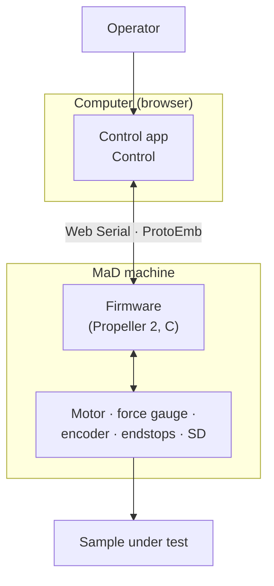

# How It Works

MaD is a full stack, from steel to pixels. This section explains each layer and
how they connect.

Start with the [system overview](overview.md) for the end-to-end data flow, then
dive into any layer:

-   [:material-engine: **The machine**](the-machine.md) — power-up, operating modes, and the safety state machine
-   [:material-chip: **Firmware**](firmware.md) — layered C on the 8-core Propeller 2
-   [:material-transit-connection-variant: **Communication protocol**](protocol.md) — the ProtoEmb binary wire format
-   [:material-web: **The control app**](control-app.md) — Web Serial + WASM in a worker
-   [:material-test-tube: **SIL emulator**](sil-emulator.md) — running the real firmware with no hardware
-   [:material-developer-board: **Hardware**](hardware.md) — the PCBs

