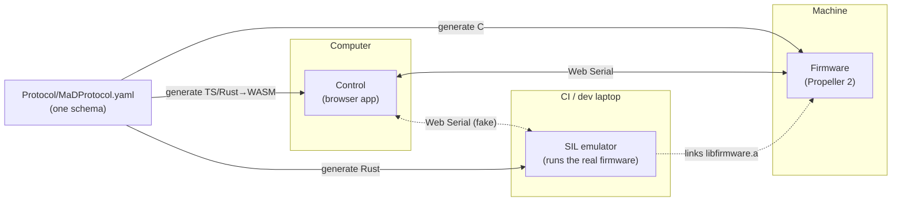
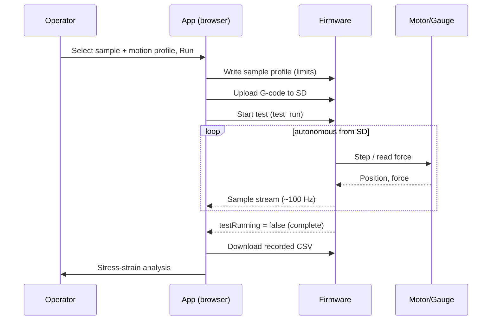

# System overview

MaD is built from five cooperating parts. The unifying idea is a **single
protocol schema**: one YAML file generates the encode/decode code for the
firmware (C), the app (TypeScript/WASM), and the test rig (Rust), so every layer
agrees on the wire format by construction.

## The parts

| Part | Language | Role |
|---|---|---|
| **Firmware** (`Firmware/MaDCore`) | C | Runs on the Propeller 2; controls the motor, reads the force gauge, executes tests from SD, and speaks the protocol. See [Firmware](firmware.md). |
| **Control app** (`Software/Control`) | TypeScript + Rust→WASM | The browser app operators use. See [The control app](control-app.md). |
| **Protocol** (`Protocol/ProtoEmb`) | Python (generator) + Rust | The schema, the code generator, and the host-side runtime. See [Communication protocol](protocol.md). |
| **SIL** (`SIL/`) | Rust | Compiles the real firmware and runs it on a host with emulated peripherals, for automated tests. See [SIL emulator](sil-emulator.md). |
| **Hardware** (`Hardware/`) | KiCad | The controller PCB and force-gauge addon. See [Hardware](hardware.md). |

## End-to-end: running a test

A key consequence: once the G-code is on the machine and the test starts, the
firmware runs the test **autonomously**. The app is a monitor — it streams live
data and detects completion, but the test does not depend on it. This is the
backbone of the [safety model](the-machine.md#safety-model).

## Why generate the protocol?

Hand-writing matching encoders in three languages is a recipe for subtle wire
bugs. Instead, MaD describes every message once and generates them — and a
[cross-language conformance check](protocol.md) asserts that C, TypeScript, and
Rust produce **byte-identical** frames. Change the schema, regenerate, and all
three layers stay in lock-step.
