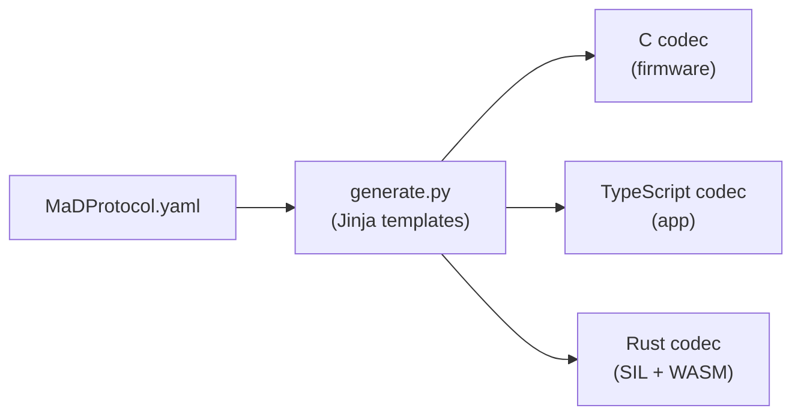

# Communication protocol (ProtoEmb)

The app and the firmware talk over a serial link using **ProtoEmb**, a small,
dependency-light binary protocol toolchain. A single
[YAML schema](https://github.com/RileyMcCarthy/MaD/blob/main/Protocol/MaDProtocol.yaml)
defines every message, and code generators emit matching encode/decode code for
**C** (firmware), **TypeScript** (the app), and **Rust** (the test rig and the
WASM core).



The toolchain itself is documented in the
[ProtoEmb README](https://github.com/RileyMcCarthy/protoemb/blob/main/README.md)
and the canonical
[wire-format spec](https://github.com/RileyMcCarthy/protoemb/blob/main/docs/wire-format.md).
This page summarises the MaD-specific contract.

## Frame layer

The link is a half-duplex request/response stream. Every frame starts with a sync
byte `0x55`; multi-byte fields are little-endian.

```text
READ request:   [0x55] [0x00] [CMD]
WRITE request:  [0x55] [0x01] [CMD] [LEN_LO] [LEN_HI] [DATA…] [CRC8]
NACK response:  [0x55] [0x00] [CMD]
ACK response:   [0x55] [0x01] [CMD]
DATA response:  [0x55] [0x02] [CMD] [LEN_LO] [LEN_HI] [DATA…] [CRC8]
NOTIFICATION:   [0x55] [0x03] [0x00] [LEN_LO] [LEN_HI] [DATA…] [CRC8]
```

- The **type byte** is direction-overloaded: `0x00` = READ / NACK, `0x01` =
  WRITE / ACK, `0x02` = DATA, `0x03` = NOTIFICATION.
- **CRC8** is CRC-8/MAXIM over the payload only. The parser resynchronises by
  scanning for `0x55`; integrity rests on the CRC.

## Payload layer

A struct is **packed** (bit-level, no padding) or **aligned** (byte-level, fixed
C-type sizes); both produce a fixed wire size known at generation time. Fields can
carry a `scale`, `min`/`max` (offset-binary), explicit bit counts, enums, nested
structs, fixed arrays, optionals, and tagged unions. The full list of MaD
messages and struct sizes is in the
[protocol-messages reference](../reference/protocol-messages.md).

## Units

Values cross the wire in **firmware-native units**; the app converts to display
units automatically.

| Quantity | Wire unit | Display unit | Scale |
|---|---|---|---|
| Force | mN | N | ÷ 1000 |
| Position | µm | mm | ÷ 1000 |
| Velocity | µm/s | mm/s | ÷ 1000 |
| Time (dwell) | ms | ms | 1 |

## Priority model

The UI queues outgoing messages at two priorities, and only one message is
in-flight at a time (the next is sent after an ACK/NACK/DATA or a 2-second
timeout):

- **HIGH** — commands and config: gcode uploads, reads/writes, motion commands.
  Sent first, FIFO.
- **LOW** — periodic polling (sample at ~100 Hz, state at 1 Hz). Coalesced so only
  the latest request per type is kept, and sent only when the high queue is empty.

This guarantees interactive operations are never blocked behind background
telemetry.

## G-code

Motion profiles are compiled to a small **G-code** dialect (`G0`/`G1` moves, `G4`
dwell, `G28` home, `G90`/`G91` absolute/relative, `G2`/`G3` arcs, and `G122` to
signal test completion). Profiles are uploaded to the machine's SD card and
played back by the firmware. See the [G-code reference](../reference/gcode.md).

## One schema, byte-identical everywhere

Because all three codecs are generated from the same schema, MaD includes a
[cross-language conformance test](../dev/protocol-codegen.md) that asserts C,
TypeScript, and Rust produce **byte-identical** wire output. Change the schema,
regenerate, and every layer stays consistent.
