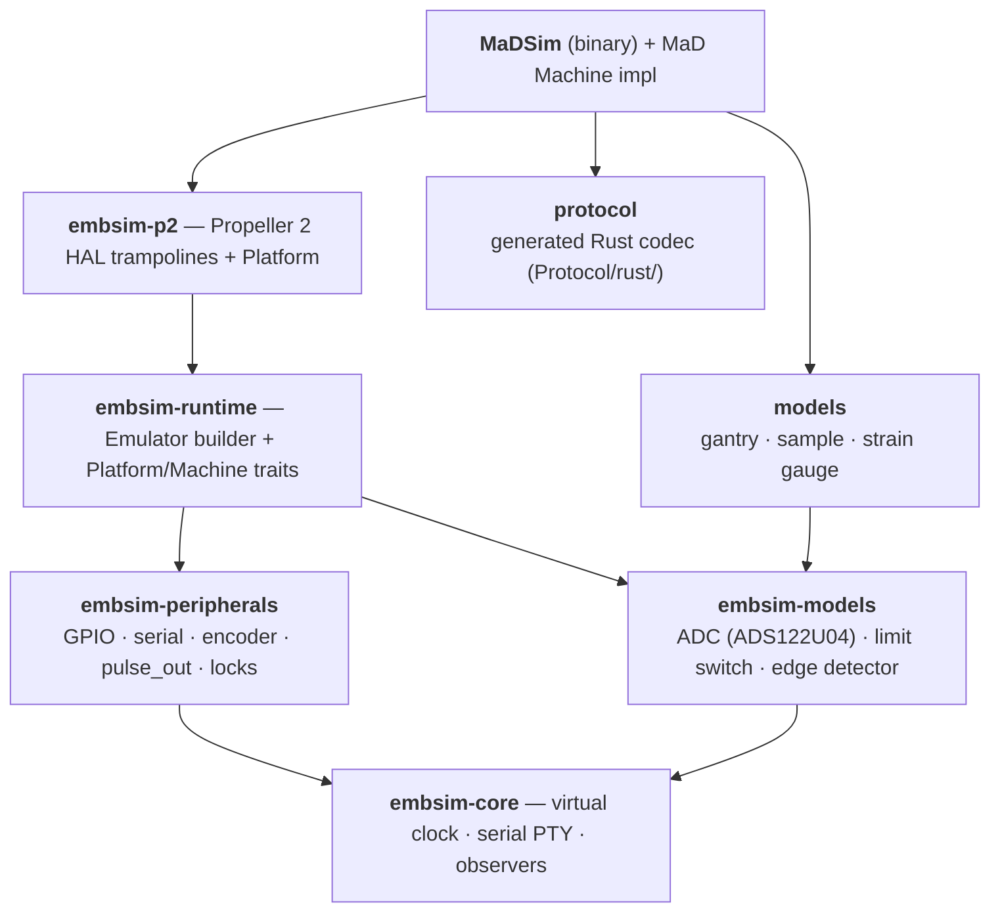
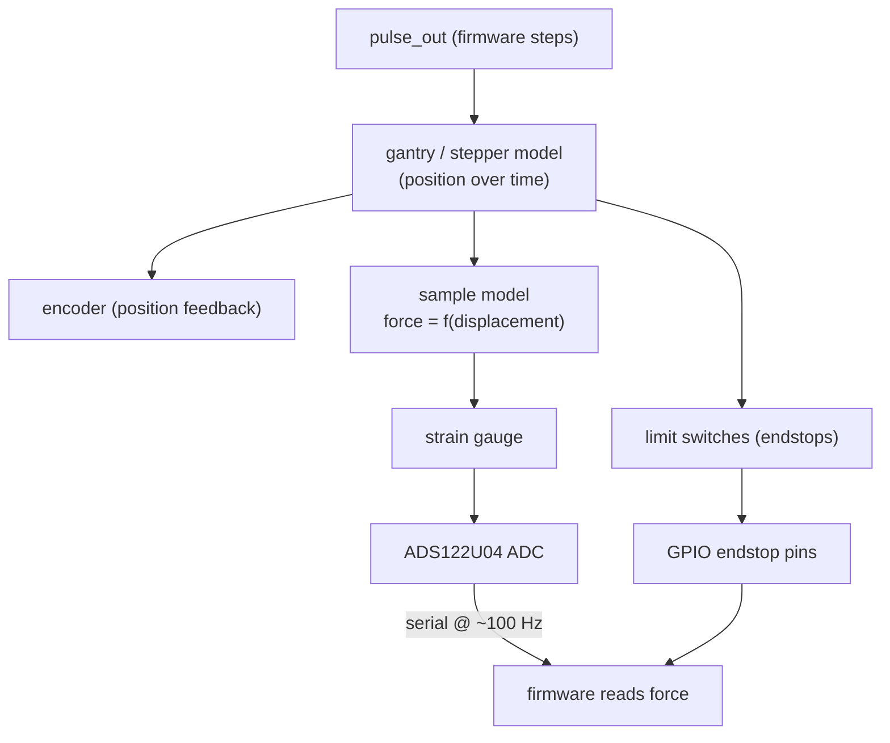

# SIL emulator

The **software-in-the-loop (SIL)** system tests the *complete* firmware ↔ UI
integration with **no physical hardware**. It compiles the **real firmware C
code** into a static library and links it into a Rust emulator that supplies the
hardware-access layer, emulated peripherals, and physics models. The control app
then connects to the emulator's virtual serial port exactly as it would to a real
board.

!!! info "This is not a mock"
    The firmware under test is the *same* C code that ships to the Propeller 2,
    built with the `native_emulator` target. SIL exercises the genuine control
    logic, protocol, and G-code execution — only the silicon is emulated. The
    screenshots in this documentation were produced by driving the app against
    this emulator.

## embsim — a reusable framework

The emulator is built on **embsim**, a generic SIL framework extracted from MaD.
The generic crates carry no MaD- or Propeller-specific assumptions; the
MaD-specific pieces are isolated.

The dependency graph is acyclic — **no generic crate depends on a project crate**.
MaD-specific code lives only in `MaDSim/`, `models/`, and
the `protocol` crate (`Protocol/rust/`). A new project supplies just a *platform crate* and a *machine*,
and gets a runnable emulator. See the
[embsim README](https://github.com/RileyMcCarthy/embsim/blob/main/README.md)
and [CONTRACT.md](https://github.com/RileyMcCarthy/embsim/blob/main/CONTRACT.md).

## The simulation chain

When the firmware commands the motor, a chain of callbacks turns pulses into
forces and feeds them back as sensor readings:

GPIO/serial/encoder/pulse_out and the ADC and limit-switch component models are
**generic** (`embsim`); the gantry, sample, and strain-gauge models are
**MaD-specific** (`models`, in `SIL/models/`).

!!! tip "Pin assignments come from the firmware itself"
    All GPIO pin numbers, encoder channels, and peripheral indices are resolved at
    runtime from the firmware's **DWARF debug info** (the `memory-inspect` tool).
    The emulator preflights every symbol the machine declares and reports *all*
    missing ones at once — so it adapts automatically if firmware enums are
    renamed.

## The virtual serial port

`embsim-core` creates a PTY pair and symlinks it (e.g. `/tmp/tty.rpi`). On real
hardware the app uses Web Serial directly; against the emulator a small WS↔PTY
bridge relays bytes to the browser's (faked) serial port — the *app source is
never modified*. See [SIL testing](../dev/sil-testing.md) for how to run it.

## One firmware per process

The firmware HAL is bound through process-global symbols against a single
`libfirmware.a`, so there is **exactly one firmware instance per OS process**. To
run several, run several processes — which is why the E2E suite uses
`workers: 1`.
