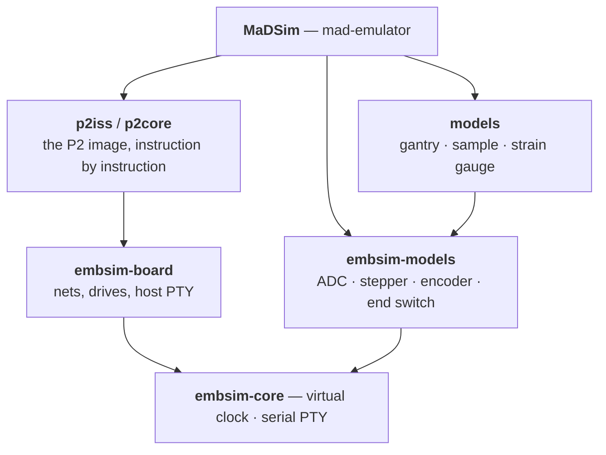
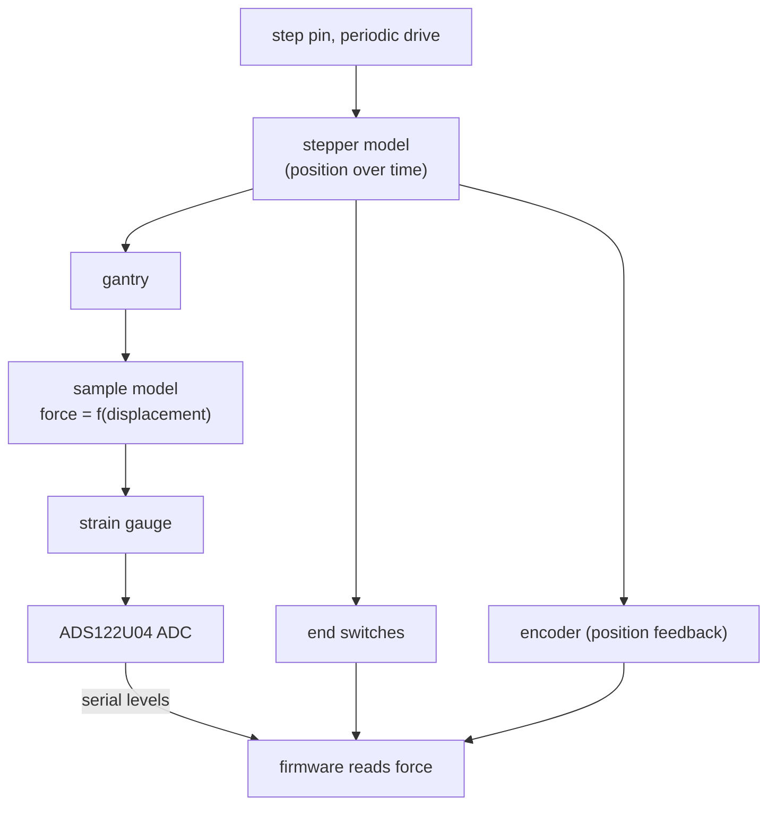

# SIL emulator

The **software-in-the-loop (SIL)** system tests the *complete* firmware ↔ UI
integration with **no physical hardware**. It executes the **Propeller 2 image**
(`pio run -e propeller2_debug`) on an instruction-set simulator. The machine's
pins are nets, and the physics models sit on those nets. The host on the
protocol link is the host's Chrome, every page and worker held to the board's
clock by embsim's `chrome-cdp` node (`mad-emulator --chrome`), for the e2e
suite and a person alike; or a PTY, for a serial console. The control app
connects to the virtual serial port exactly as it would to a real board.

!!! info "This is not a mock"
    The firmware under test is the image you flash. The ISS executes its
    instructions, including `WRPIN` / `DIR` / `OUT`, so a wrong smart-pin mode
    or a wrong `clkfreq` shows up on the wire. The screenshots in this
    documentation were produced by driving the app against this emulator.

## embsim — a reusable framework

The board is **embsim**. A part is a node: it publishes a drive and receives a
sense. MaD supplies the core (the ISS) and the bench around it. The generic
crates carry no MaD protocol and no gantry geometry.

```mermaid
flowchart TB
    consumer["<b>MaDSim</b> — mad-emulator"]
    iss["<b>p2iss</b> / <b>p2core</b><br/>the P2 image, instruction by instruction"]
    board["<b>embsim-board</b><br/>nets, drives, host PTY"]
    models["<b>embsim-models</b><br/>ADC · stepper · encoder · end switch"]
    core["<b>embsim-core</b> — virtual clock · serial PTY"]
    madmodels["<b>models</b><br/>gantry · sample · strain gauge"]

    consumer --> iss --> board
    consumer --> models
    consumer --> madmodels
    board --> core
    models --> core
    madmodels --> models
```

The dependency graph is acyclic — **no generic crate depends on a project crate**.
MaD-specific code lives in `MaDSim/`, `p2iss/`, `p2core/`, `models/`, and
the `protocol` crate (`Protocol/rust/`). See the
[embsim README](https://github.com/RileyMcCarthy/embsim/blob/main/README.md).

## The simulation chain

When the firmware commands the motor, a chain of callbacks turns pulses into
forces and feeds them back as sensor readings:

```mermaid
flowchart TB
    pulse["step pin, periodic drive"] --> motor["stepper model<br/>(position over time)"]
    motor --> enc["encoder (position feedback)"]
    motor --> limit["end switches"]
    motor --> gantry["gantry"]
    gantry --> sample["sample model<br/>force = f(displacement)"]
    sample --> gauge["strain gauge"]
    gauge --> adc["ADS122U04 ADC"]
    adc -->|"serial levels"| fw["firmware reads force"]
    limit --> fw
    enc --> fw
```

The ADC, stepper, encoder, and end switch are **generic** (`embsim-models`).
The gantry, sample, and strain gauge are **MaD-specific** (`SIL/models/`).
Pin numbers are the firmware's, named in `iss_description::pins` from
`HW_pins.h`.

## The virtual serial port

The host end sits on the protocol nets (`P53`/`P55`, 2,000,000 baud 8N1), one
of two components:

- **Chrome on the board's clock** (`--chrome`, `make playground` / `make e2e`):
  embsim's `chrome-cdp`. Every page's `navigator.serial` is the node's shim,
  whose one port is this line (USB `0403:6001`), by Chrome's own rules; every
  page and dedicated worker lives the board's time, a 1 ms quantum at a time
  over DevTools, so the app's 2 s response timeout is 2 s of the board's time.
  Its rail pins are wired to the P2's 3.3 V and the bench ground.
- **A PTY** (`make playground-pty`): an embsim `HostPty`, a PTY pair symlinked
  at the path `--pty-path` names (`/tmp/tty.iss`), for a serial console. A
  browser behind it (the WS↔PTY bridge) runs at host speed while the ISS runs
  at a few percent of real time, so it measures the host, not the machine.

On real hardware the app uses Web Serial directly. See
[SIL testing](../dev/sil-testing.md).

## One emulator per process

The virtual clock and the host PTY are process-global, so there is **one
emulator per OS process**. To run several, run several processes — which is
why the E2E suite uses `workers: 1`.
