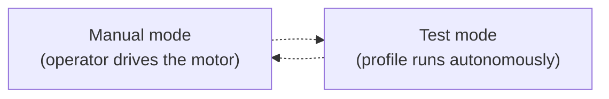
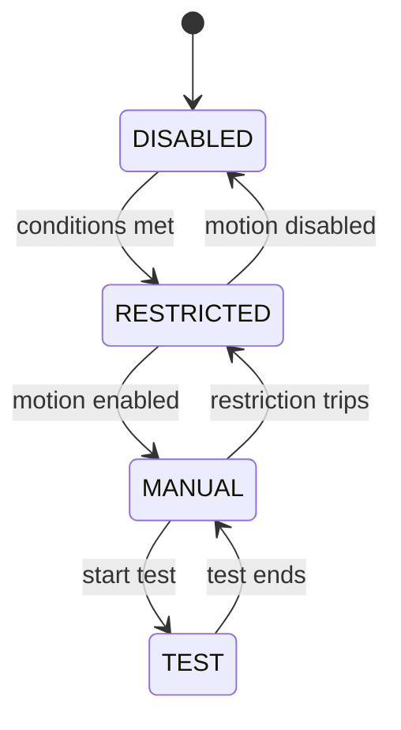

# The machine

This page covers operating the physical machine: how it powers up, its operating
modes, and the safety state machine that gates all motion.

## Power-up sequence

Power is applied in stages so the motion electronics and safety chain come up in
a known-safe order:

1. Turn on the **mains inlet** power switch (powers the motion-control
   electronics).
2. Press the momentary **ON** button (applies DC power to the status switches and
   the ESD chain).
3. Release the **ESD switch** (applies AC power to the servo controller).
4. When all safety criteria are met, **enable motion** from the control app.
5. To power down, reverse the order — press **OFF** to remove DC power.

## Operating modes

### Manual mode

Drive the motor directly from the app's [Live controls](../user-guide/manual-control.md):

- incremental jog,
- home the axis,
- set / move to a gauge length,
- zero force and length.

### Test mode

Automated execution from a [motion profile](../user-guide/motion-profiles.md):

1. Load a **sample profile** (`.sp`) defining material limits.
2. Load a **motion profile** (`.mp`) defining the test pattern.
3. Run — the moves are compiled to G-code, uploaded to the machine's SD card,
   and executed. Data (force, position, stress, strain) is recorded in real time.

## The state machine

Internally, the firmware tracks a machine state that gates motion:

| State | Meaning |
|---|---|
| **Disabled** | Motion not enabled — the safe default. |
| **Restricted** | Motion is enabled but limited by an active safety restriction (endstop, force/tension limit, door interlock). |
| **Manual** | Free motion control from the app. |
| **Test** | Automated test execution from a motion profile. |

All motion is gated through the firmware's `app_control_motionEnabled()` — see the
[firmware](firmware.md) page and the
[states, faults & restrictions reference](../reference/machine-states.md).

## Safety model

!!! danger "The machine is the safety authority"
    MaD is designed so that **the control app is never a safety device**. The
    machine has:

    - a **hardware e-stop** and its own sensors,
    - **faults** that latch and require a reboot (power/ESD, watchdog, cog
      failure, servo or force-gauge comms loss), and
    - **restrictions** that limit motion until the condition clears (endstops,
      tension limits, door interlock).

    Because a running test executes **autonomously from the SD card**, losing the
    app — closing the tab, unplugging USB — is an intentional **non-event**: the
    test keeps running and the app reconnects to keep monitoring. The app's
    **STOP** button is a convenience that disables motion in software; it is *not*
    a substitute for the hardware e-stop.
