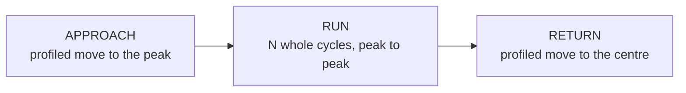
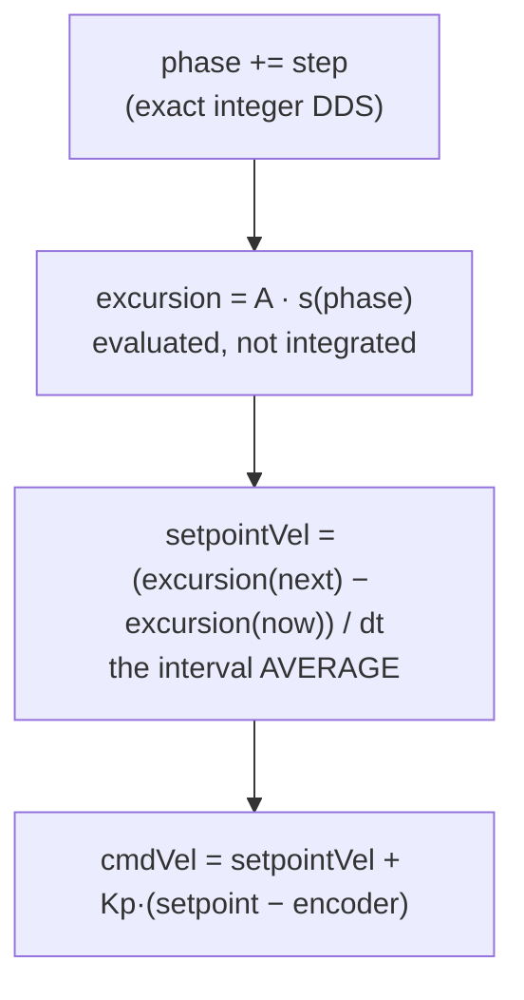
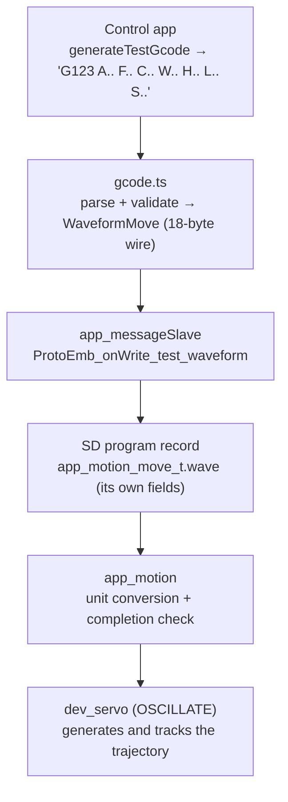

# Waveform motion control (G123)

MaD runs **cyclic / fatigue waveforms** — a position that oscillates as a
continuous function of time, repeated for many cycles. This page explains how
that works end to end, the control structure behind it, and why it is built the
way it is.

!!! summary "In one sentence"
    The host sends **one** compact command (`G123` → a `WaveformMove`); the
    servo driver generates the trajectory itself, **evaluating** the commanded
    position from a phase accumulator each control tick, and closes a position
    loop on the encoder to follow it — measured to within **1 µm**.

## Why not just send G-code segments?

A waveform used to be expanded **on the host** into ~32 short `G1` segments per
cycle. That works, but:

| Concern | Host segment expansion | Firmware-native waveform |
| --- | --- | --- |
| **Smoothness** | each segment is a discrete *move → stop → move* | one continuous trajectory |
| **Cycle count** | a 1 M-cycle fatigue test = 32 M G-code lines (impossible) | one command, any cycle count |
| **Timing** | per-segment feedrate + queue latency drift the frequency | phase advanced from the control clock, exactly |

So for fatigue-scale, smooth, frequency-accurate motion the trajectory has to be
generated **in the firmware**, close to the hardware.

## The cycle is a template, not a shape

One cycle is four segments, in phase order:

```text
      [ hold at +A ]   [ traverse down ]   [ hold at -A ]   [ traverse up ]
         dwellHigh                            dwellLow
      |<---------------------- one period, 1/f ---------------------->|
```

`shape` names **only the traverse** — how the carriage gets from one peak to the
other. Dwell and skew are separate parameters that apply to *every* shape.

That factorisation is the point. If `shape` named a whole waveform, every
combination anyone wanted ("triangle with a hold", "skewed sine") would need its
own variant, and the list would grow forever while the grammar stayed rigid.

A traverse is a normalised curve `s(u)`, with `u` and `s` both in `[0,1]` and
**zero slope at both ends**:

| `shape` | traverse | `s(u)` |
| --- | --- | --- |
| `0` SINE | half-cosine | `(1 − cos(πu)) / 2` |
| `1` TRIANGLE | constant rate with ramps (trapezoidal) | see below |

The zero-slope end condition is the whole trick: it means a traverse can butt
against a hold, against rest, or against another traverse without a velocity
step the machine cannot deliver. Dwell and skew therefore compose freely instead
of each needing its own feasibility argument.

A plain sinusoid falls **out** of this template as the zero-dwell, symmetric,
sine-traverse case — `centre + A·cos(2πφ)` exactly.

### Why the cycle starts at a peak

A sinusoid's velocity is `ωA·cos`, so at its **centre** the velocity is maximal.
A machine standing at rest at the centre cannot begin one without infinite
acceleration. The only phases at which a sinusoid can be joined or left at rest
are its **peaks**.

So a waveform runs as three segments:



Every instant of all three is inside the acceleration budget, so the delivered
trajectory equals the requested one rather than a lagged copy of it.

!!! note "This replaced a position anchor"
    Earlier the trajectory started at the centre, the ramp-in lost
    `Vpeak²/(2·Amax)` of travel, and the whole oscillation sat that far below the
    centre the operator asked for — 0.82 mm on the reference 5 mm / 1 Hz case,
    enough to drive the bottom of the stroke into the lower limit switch. An
    outer position loop in `app_motion` was added to claw it back. Starting at
    the peak removes the cause, so the anchor, its gain and its clamp are gone.

### The triangle traverse

A literal triangle reverses velocity instantly at its corners, demanding
infinite acceleration. The deliverable realisation is a **trapezoidal rate
profile**: ramp at `maxAccel`, cruise, ramp down.

Writing `r` for the ramp's share of the traverse, the whole profile collapses to
that one parameter:

```text
r = (1 − √(1 − 8A / (a·τ²))) / 2
```

and the traverse is feasible exactly when that root is real, i.e. `a·τ² ≥ 8A`.
`r → 0.5` is a pure triangular rate with no cruise; smaller `r` is a longer
cruise. It is solved once when the waveform is accepted, so the 1 kHz tick does
no division and no square root.

## Inside the control loop

`dev_servo_run()` ticks on the MOTOR cog at 1 kHz. In `OSCILLATE` mode the
setpoint is **evaluated from the phase**, never integrated from a rate — so
there is no accumulator that can fall behind and stay behind.



Two details carry most of the accuracy:

**Command the interval average, not the instantaneous velocity.** They differ by
`a·dt/2`, and that difference is a bias of one sign for a whole half cycle — so
the position loop has to stand off by `a·dt/(2·Kp)` just to generate it. That is
2.4 µm of standing error against a *perfect* plant. Differencing the evaluated
waveform removes it exactly, for any shape. This is only possible *because* the
setpoint is evaluated rather than integrated.

**Difference the excursion, not the absolute position.** The centre can be
24,576,000 counts out at the far end of the machine, where a `float`'s ulp is 2
counts; differencing two absolute positions there folds a rounding error into a
per-tick displacement of only ~63 counts. Keeping the subtraction on the
excursion makes tracking independent of where along the machine the test sits.

### The phase accumulator is exact

The phase is a wrapping 32-bit accumulator — the wrap *is* the cycle boundary,
so there is no modulo and no elapsed-time counter. The increment is

```text
Δφ = freq_µHz · elapsed_µs · 2³² / 10¹²
```

and `10¹² = 2¹² · 5¹²`, so the `2¹²` cancels and the ratio is **exactly**
`2²⁰ / 5¹²` — two integers. Dividing by `5¹²` and carrying the remainder into
the next tick makes the accumulated phase exact for all time, whatever the tick
jitter.

Truncating the step instead (the obvious `(uint32_t)(f·dt·2³²)`) loses 0.296
phase units per tick at 1 Hz: 1.9 µm of position error after an hour and 45.7 µm
after a day. A fatigue run is precisely the case that suffers, and precisely the
case a two-second test cannot see.

!!! warning "FlexC cannot hold a named 64-bit local"
    `const uint64_t n = (uint64_t)a * b;` fails the whole build with
    `Cannot handle expression yet`, reported against a libc file rather than the
    offending line. The same arithmetic as a single expression compiles fine —
    it is the 64-bit *destination* FlexC mishandles, the same root as its
    `dest64 = cond ? A : B` bug. The accumulator therefore goes through
    `lib_utility_muldivmod64_unsigned`, which reaches the P2's CORDIC (QMUL,
    then SETQ+QDIV with the remainder in QY) and never materialises a 64-bit C
    variable.

## Refused, not approximated

A waveform the machine cannot deliver is **rejected**, not run at whatever the
limiter allows. Running a smaller one instead produces a specimen that never saw
the loading the report claims it did — on a fatigue test that is a wrong result,
not a slow one.

Feasibility is decided **per traverse**, because skew and dwell make the two
halves different lengths: a cycle can be achievable going down and impossible
coming back up, and approving it on an average would run a profile nobody asked
for. Holds that together exceed the period are refused for the same reason — the
alternative is silently trimming the dwell, and dwell is the variable the test
exists to study.

The acceleration budget also bounds the discretisation error for free. Between
samples the carriage travels a chord where the ideal is an arc, and that error is
at most `a·dt²/8` = 0.6 counts (0.075 µm) — under 8% of the 1 µm budget, for
*every* waveform the driver accepts. No separate sampling check is needed.

## End-to-end data flow

A waveform is **one record** in the test program, self-contained on the SD card
so a test runs unattended.



The waveform carries **its own fields** rather than borrowing a move's
position/feedrate/pause slots. Smuggling it through those is how the shape bit
came to live in the top byte of the feedrate — where `app_motion` then masked it
off and evaluated a sine regardless, so every triangle ever run was a sine.

`app_motion`'s whole remaining job is unit conversion and asking the driver
whether it is done. Completion is the driver's arrival verdict: it alone knows
how many cycles have elapsed and whether the closing move has landed.

## The G-code

```text
G123 A<mm> F<Hz> C<cycles> [W<shape>] [H<s>] [L<s>] [S<skew>]
```

| Letter | Meaning | Unit | Wire resolution |
| --- | --- | --- | --- |
| `A` | peak excursion from the mean (not peak-to-peak) | mm | 0.1 µm |
| `F` | frequency of the **whole** cycle, holds included | Hz | 1 µHz |
| `C` | whole cycles | count | 1 |
| `W` | traverse profile — 0 sine, 1 triangle | — | 1 byte |
| `H` | hold at the **upper** peak | s | 1 ms |
| `L` | hold at the **lower** peak | s | 1 ms |
| `S` | share of the traversing time spent descending; 0.5 symmetric | ratio | 1 ‰ |

Omitting `H`, `L` and `S` gives a hold-free symmetric cycle — exactly what
`G123` has always meant, so an existing program keeps its meaning.

Dwell is **per peak** because creep-fatigue is a hold at peak tension with *no*
hold in compression; a single symmetric dwell cannot express the test that most
needs one. Holds take their time from the traverses, not from the period, so
adding a hold never silently changes a fatigue test's frequency.

```gcode
G1 X12.5 F31.4                    ; ramp to the mean
G123 A5 F1 C1000 W0               ; sine, 5 mm, 1 Hz, 1000 cycles
G123 A5 F0.5 C200 W1 H2.0 L0      ; triangle, 2 s hold at peak tension only
G123 A2 F0.2 C50 W0 S0.8          ; 80% of the cycle loading, 20% unloading
G122                              ; signal test complete
```

Resolutions are set by a physical limit rather than a round number: an encoder
count is 0.122 µm, so 0.1 µm means the wire is no longer the coarsest step in the
chain; and the phase accumulator is exact in µHz, so nothing is lost after the
frequency is quantised.

!!! note "Changing the wire format is a hard break, by design"
    The generated runtime gates the waveform write on an **exact** payload-size
    match, so a new host against old firmware NACKs at upload rather than
    running a misread test. The rule that follows: `WaveformMove`'s layout must
    never change without changing its byte count.

## Limits & future work

- **Dwell and skew are not authorable in the Create UI yet** — the grammar, the
  wire and the firmware all carry them; hand-written G-code can use them.
- **No force or strain loop.** The waveform is a *position* trajectory. True
  load-controlled fatigue (closing a loop on the force gauge) is a separate
  project; this generator is a prerequisite for it.
- **Tracking margin at the envelope's edge.** At the fastest waveform the driver
  will accept, the worst deviation is 0.844 µm — inside the 1 µm contract, but
  the dominant term is the transient after each velocity reversal, which decays
  with a 125-tick time constant at `Kp = 8` against a 142-tick half cycle at
  3.5 Hz. Raising `Kp` would reclaim most of that margin and wants validating on
  hardware.
- **More traverse profiles.** `shape` is a whole byte with 2 of 256 used.

## How it is tested

Verified at three levels, so the recorded data is proven to match the commanded
trajectory rather than merely to oscillate:

| Level | What it proves | Where |
| --- | --- | --- |
| **Unit (web)** | `G123` parse / validate / encode, refusal of unknown shapes, overfull holds and impossible skew; golden wire bytes derived by hand from the field table | `domain/gcode.test.ts`, `protocol/codec.parity.test.ts` |
| **Unit (firmware)** | the measured encoder position stays within 1 µm of an **independently recomputed** trajectory, across an amplitude/frequency sweep, at five centres spanning the machine's travel, at the exact feasibility boundary, and with dwell and skew in play; the phase returns to exactly zero after whole cycles | `test/test_dev_servo` |
| **End-to-end (SIL)** | the **recorded position** from a full run (host → firmware → gantry → CSV) fits the commanded waveform: least-squares sinusoid fit `R² > 0.8`, amplitude, cycle count, and the centre to 0.15 mm; for triangles, the fitted fundamental is `8/π² = 0.811` of the peak rather than a sine's `1.000` | `e2e/run-all.mjs` (`WAVE-*`) |

That last row is the one that catches a shape being ignored. Amplitude,
frequency, centre and cycle count are identical between a sine and a triangle,
so every other assertion passes either way — which is exactly how the shape bit
stayed masked off for as long as it did, with every test green.
