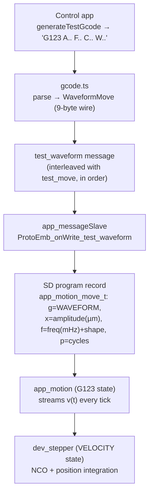
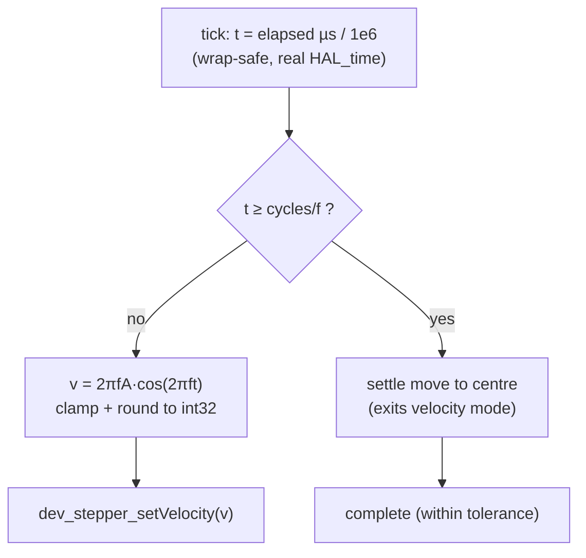
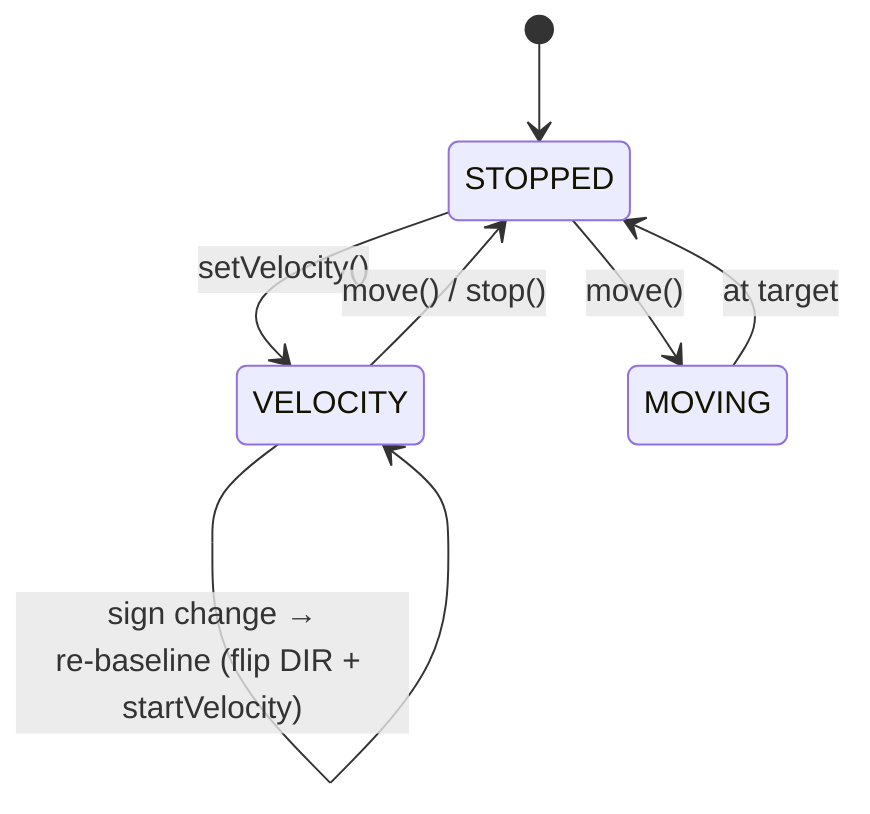

# Waveform motion control (G123)

MaD can run **cyclic / fatigue waveforms** — a position that oscillates as a
continuous function of time, e.g. a sine, repeated for many cycles. This page
explains how that works end to end, the control-theory structure behind it, and
why it is implemented the way it is.

!!! summary "In one sentence"
    The host sends **one** compact command (`G123` → a `WaveformMove`); the
    firmware **generates the trajectory itself** and streams its instantaneous
    *velocity* to a numerically-controlled-oscillator (NCO) step generator, whose
    pulses are tracked to a position by the **closed-loop servo drive**.

## Why not just send G-code segments?

Earlier, a waveform was expanded **on the host** into ~32 short `G1` linear
segments per cycle. That works but has three problems:

| Concern | Host segment expansion | Firmware-native waveform |
| --- | --- | --- |
| **Smoothness** | each segment is a discrete *move → stop → move*; velocity dips at every boundary | one continuous pulse train, velocity updated on the fly |
| **Cycle count** | a 1 M-cycle fatigue test = 32 M G-code lines (impossible) | one command, any cycle count |
| **Timing** | per-segment feedrate + queue latency drift the frequency | sampled against a real hardware timebase |

So for fatigue-scale, smooth, frequency-accurate motion the trajectory has to be
generated **in the firmware**, close to the hardware.

## Control-theory structure

The system is a **cascade**: an open-loop *feedforward trajectory generator* in
the firmware drives the *closed-loop position servo* inside the stepper drive.
The firmware does **not** run its own position loop — the drive (a closed-loop
step/dir servo with its own encoder) does. The firmware's only job is to emit the
*ideal* command.

```mermaid
flowchart LR
    subgraph HOST["Host (control app)"]
        P["Waveform params<br/>shape, A, f, cycles, centre"]
    end
    subgraph FW["Firmware (Propeller 2) — feedforward trajectory"]
        TG["Trajectory generator<br/>x(t)=centre+A·sin(2πft)"]
        VC["Velocity command<br/>v(t)=ẋ(t)=2πfA·cos(2πft)"]
        NCO["NCO step generator<br/>(smart pin, P_NCO_FREQ)"]
        TG --> VC --> NCO
    end
    subgraph DRIVE["Closed-loop servo drive"]
        PID["Internal position loop<br/>(PID + its own encoder)"]
        MECH["Motor + gantry"]
        PID --> MECH --> PID
    end
    P -->|"one G123 / WaveformMove"| TG
    NCO -->|"step / dir pulses"| PID
    MECH -.->|"jaw position"| SENSE["Encoder / force gauge<br/>(monitoring)"]
```



- **Feedforward (firmware):** computes the ideal position trajectory `x(t)` and
  commands its derivative `v(t)`. No feedback is used to *generate* it.
- **Feedback (drive):** the servo drive closes the position loop on its own
  encoder, correcting for load, friction and missed steps. The commanded pulse
  train *is* the setpoint.
- **Monitoring (firmware):** MaD reads the machine encoder and force gauge for
  display, limits and logging — but these do **not** feed back into the waveform
  generator (that closed loop, on force or strain, is future work — see
  [Limits & future work](#limits-future-work)).

### The math

For a sine waveform about a centre position `c`, amplitude `A`, frequency `f`:

```text
x(t) = c + A·sin(2πf·t)
```

A step generator is fundamentally a **velocity** device (a pulse rate), and
position is the integral of velocity. So instead of commanding positions we
command the analytic instantaneous velocity, and the accumulated pulses
reconstruct the position:

```text
v(t) = ẋ(t)      = 2πf·A·cos(2πf·t)          ← what we command (the step rate)
∫ v(τ) dτ        = A·sin(2πf·t) = x(t) − c    ← what the pulses integrate to
```

This is the key idea: **drive the rate by `f'(t)`, get the position `f(t)` for
free** — with no per-segment stop/start.

```
 position x(t)        velocity v(t) = ẋ(t)
   c+A |   .-‾‾-.        +2πfA |‾·.        .·       v crosses 0
       | .'     '.            |   '·.    .·'        at the position
     c |·· · · · ··· · · ·   0|· · ·'·.·'· · · ·    peaks (smooth
       |'.       .'            |        ·.          direction reversal)
   c-A |  '·_ _·'         -2πfA|          '·.__.·'
       +-----------> t          +-----------> t
```

The velocity passes through **zero exactly at the position peaks**, so direction
reversals happen where the motor is barely moving — they are mechanically smooth.

## End-to-end data flow

A waveform is **one record** in the test program, self-contained on the SD card
so a test runs unattended.



The waveform reuses the **existing 13-byte move record** (`g/x/f/p`) — `g` tags it
as a waveform and the numeric fields are reinterpreted — so nothing in the SD
read / queue / playback pipeline had to change.

## Inside the firmware loop

`app_motion_run()` ticks on the CONTROL cog at ~1 kHz. While a `G123` is the
active move, each tick:



`dev_stepper` runs a small state machine. The new `VELOCITY` state:



Each tick in `VELOCITY` it reads the cumulative emitted pulse count from the NCO,
integrates it into `currentSteps` (signed by direction), and retargets the rate:

- **same direction:** update the NCO frequency on the fly (`HAL_pulseOut_setFrequency`) — glitch-free.
- **direction reversal:** *re-baseline* — flip the `DIR` pin, snapshot the
  current position as the new origin, and restart the NCO. Because the encoder
  position is reconstructed as `base + dir × emitted`, re-baselining at the
  reversal (where `v≈0`) keeps the position continuous across the turn.

```
 NCO output (continuous square wave; frequency = |v| updated each tick)
   ┌┐┌┐┌─┐┌─┐┌──┐┌──┐┌──┐┌─┐┌─┐┌┐┌┐         (rate falls toward the peak,
   ┘└┘└┘ └┘ └┘  └┘  └┘  └┘ └┘ └┘└┘└┘…         then rises again after reversal)
        ──────────────────►  direction = + ──┊── direction = −
                                          (DIR flips here, v≈0)
```

## NCO step generation

On the Propeller 2 the step pin runs in **`P_NCO_FREQ`** mode: a 32-bit phase
accumulator adds a frequency word `X` every clock and toggles the pin on
overflow, giving a continuous square wave at `f_step = X·f_clk / 2³²`. The rate is
retargeted by writing a new `X` (`WYPIN`) — no stop/start, and sub-step phase is
preserved. Position is tracked in firmware by integrating `Σ(frequency × Δclock)`.

In the SIL emulator the same contract is modelled in Rust
(`embsim/peripherals/src/pulse_out.rs`): a velocity mode whose cumulative emitted
count = `emitted_base + elapsed × frequency`, banked across rate changes. The
gantry model integrates that count (with the `DIR` GPIO) into a position — so the
emulator reproduces exactly what the firmware commands.

## Why velocity (NCO) and not finer position segments?

A position-targeted segment is a *move-to-target-then-stop*; chaining them gives
the velocity dips and the granularity/timing problems above. Streaming velocity:

- **no stop/start** between samples — the pulse train never pauses;
- **frequency-accurate** — `v` is sampled at the *real* elapsed time, so tick
  jitter doesn't drift the cycle frequency;
- **compact** — one command runs arbitrarily many cycles.

It is, in effect, the continuous limit of "infinitely fine, velocity-matched,
never-stopping segments."

## Limits & future work

- **Defensive clamps.** The commanded rate is clamped to a safe maximum
  (prevents integer overflow on extreme parameters) and the host validates peak
  velocity / amplitude / cycles before sending.
- **Open-loop *position*, closed-loop *drive*.** The waveform is a position
  trajectory realised by the drive's closed loop. There is no firmware loop on
  **force** or **strain** yet — true load-controlled fatigue (PID on the force
  gauge) is a separate future project; the velocity generator here is a
  prerequisite for it.
- **Shapes.** v1 ships **sine**. `WaveformShape` (and the wire/parser) reserve
  other shapes (e.g. triangle) as a framework; adding one is a firmware function
  + re-enabling the picker.

## How it is tested

The waveform is verified at three levels so the recorded data is proven to match
the commanded `f(t)`:

| Level | What it proves | Where |
| --- | --- | --- |
| **Unit (web)** | `f(t)` math, `G123` parse/encode/validate, golden wire bytes | `domain/*.test.ts`, `protocol/codec.parity.test.ts` |
| **Unit (firmware)** | the streamed velocity = `2πfA·cos` (peak ± and reversals) across many amplitude/frequency/cycle combos; `dev_stepper` velocity integration + reversal re-baseline | `test/test_app_motion`, `test/test_dev_stepper` |
| **End-to-end (SIL)** | the **recorded position** from a full run (host → firmware → gantry → CSV) fits the commanded sine — least-squares sinusoid fit `R² > 0.8` at the commanded frequency, plus amplitude and cycle-count checks, for several distinct waveforms | `e2e/run-all.mjs` (`WAVE-*`) |
