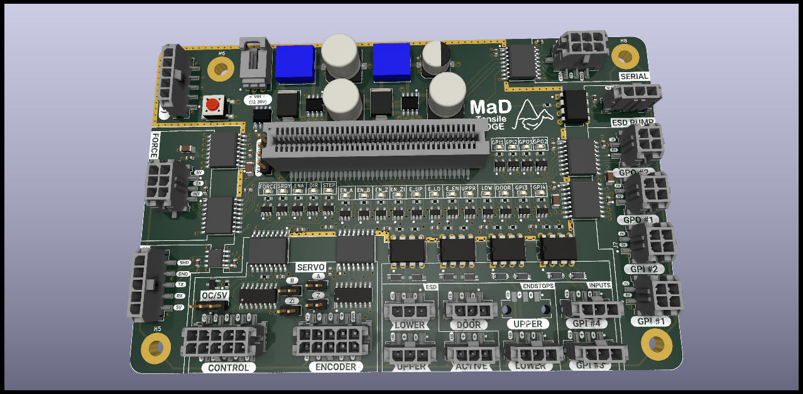
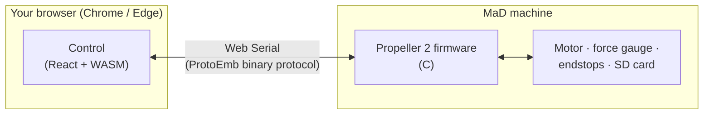

# MaD — Open-Source Tensile Testing Machine

**MaD** is a relatively low-cost (**< $4,000**), portable, spray-resistant,
user-modifiable, open-source **uniaxial tensile testing machine** designed for
low-modulus elastomeric and biologic materials.

It is a complete, open system: the mechanical hardware, the Propeller 2 firmware,
the control software, the communication protocol, and a full software-in-the-loop
test rig are all in [one repository](https://github.com/RileyMcCarthy/MaD).

[:rocket: Launch the control app](https://rileymccarthy.github.io/MaD/app/){ .md-button .md-button--primary }
[Get started](getting-started/index.md){ .md-button }
[How it works](how-it-works/index.md){ .md-button }

{ width=520 }

/// caption
The MaD EdgeBoard — the controller PCB that hosts the Propeller 2.
///

## What can it do?

| Parameter | Range |
|---|---|
| Strain rate | 0 – 2 m/s |
| Force measurement | 1 – 10 N |
| Gauge length | 10 – 150 mm |
| Strain length | 0 – 500 mm |
| Data rate | 1000 samples/sec |

See the full [specifications](reference/specifications.md).

## The control app runs in your browser

There is **nothing to install**. The control app —
[**Control**](https://rileymccarthy.github.io/MaD/app/) — is a
Progressive Web App that talks straight to the machine over the
[Web Serial API](getting-started/requirements.md), with all the protocol logic
compiled to WebAssembly from the same Rust core the firmware tooling uses.

!!! info "Chromium-only"
    Web Serial and the File System Access API are available only in Chrome and
    Edge on desktop. See [Requirements & browser support](getting-started/requirements.md).

-   :material-rocket-launch: **New here? Start with the basics**

    ---

    Open the app, connect to a machine, and run your first test.

    [:octicons-arrow-right-24: For operators](getting-started/operators.md)

-   :material-book-open-variant: **Day-to-day use**

    ---

    Build sample and motion profiles, run tests, and analyse results — every
    screen, with screenshots.

    [:octicons-arrow-right-24: User guide](user-guide/index.md)

-   :material-cog-outline: **Under the hood**

    ---

    The machine, the firmware, the protocol, the app, and the SIL emulator —
    explained with diagrams.

    [:octicons-arrow-right-24: How it works](how-it-works/index.md)

-   :material-code-tags: **Build & contribute**

    ---

    Build the firmware and app, run the test rig, regenerate the protocol, and
    cut releases.

    [:octicons-arrow-right-24: Developer guide](dev/index.md)

## How the pieces fit together

The browser app and the firmware speak a single, schema-defined binary protocol
([**ProtoEmb**](how-it-works/protocol.md)) generated from one
[YAML file](https://github.com/RileyMcCarthy/MaD/blob/main/Protocol/MaDProtocol.yaml)
into C, TypeScript, and Rust — so every layer agrees on the wire format
byte-for-byte.

## Repository at a glance

| Area | Path | What |
|---|---|---|
| Firmware | `Firmware/MaDCore/` | Embedded C for the Parallax Propeller 2 |
| Control app | `Software/Control/` | Browser app (Web Serial + WASM) — the app you launch |
| Protocol | `Protocol/ProtoEmb/` | YAML schema → generated C / TS / Rust + host runtime |
| SIL | `SIL/` | Rust emulator that runs the real firmware + Playwright tests |
| Hardware | `Hardware/` | KiCad PCB designs (EdgeBoard, DS2 Addon) |

[:octicons-arrow-right-24: Full repository layout](dev/repo-layout.md)

## License

MaD is released under the **MIT License**.
