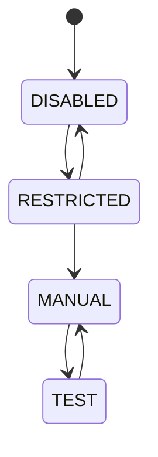

# States, faults & restrictions

The firmware (`APP/app_control`) tracks the machine state and gates all motion.
This is the authoritative list, mirrored in the protocol's `FaultedReason` and
`RestrictedReason` enums.

## States

| State | Meaning |
|---|---|
| **DISABLED** | Motion not enabled — the safe default |
| **RESTRICTED** | Motion enabled but limited by an active restriction |
| **MANUAL** | Free motion control from the app |
| **TEST** | Automated test execution from a motion profile |

## Faults

A **fault latches** and generally requires a reboot to clear. While faulted,
motion is not permitted.

| Fault | Cause |
|---|---|
| `NONE` | No fault |
| `COG` | A processor core (cog) failed / stopped unexpectedly |
| `WATCHDOG` | A watchdog timeout (a task stopped servicing it) |
| `ESD_POWER` | ESD safety-chain power fault |
| `ESD_SWITCH` | ESD switch fault |
| `ESD_UPPER` | Upper ESD trip |
| `ESD_LOWER` | Lower ESD trip |
| `SERVO_COMMUNICATION` | Lost communication with the servo controller |
| `FORCE_GAUGE_COMMUNICATION` | Lost communication with the force gauge |

## Restrictions

A **restriction limits motion** while a condition holds and **clears
automatically** when the condition resolves.

| Restriction | Cause |
|---|---|
| `NONE` | No restriction |
| `SAMPLE_LENGTH` | Sample length limit reached |
| `SAMPLE_TENSION` | Sample tension limit reached |
| `MACHINE_TENSION` | Machine tension (protection) limit reached |
| `UPPER_ENDSTOP` | Upper endstop triggered |
| `LOWER_ENDSTOP` | Lower endstop triggered |
| `DOOR` | Door interlock open |

## How they surface

These appear as **State badges** on the [Live](../user-guide/live-monitoring.md)
screen (hover for an explanation), and drive the safety behaviour described in
[the machine](../how-it-works/the-machine.md#safety-model). The `MotionState`
enum (`DISABLED`, `WAITING`, `MOVING`) separately reports what the motion
subsystem is doing.
