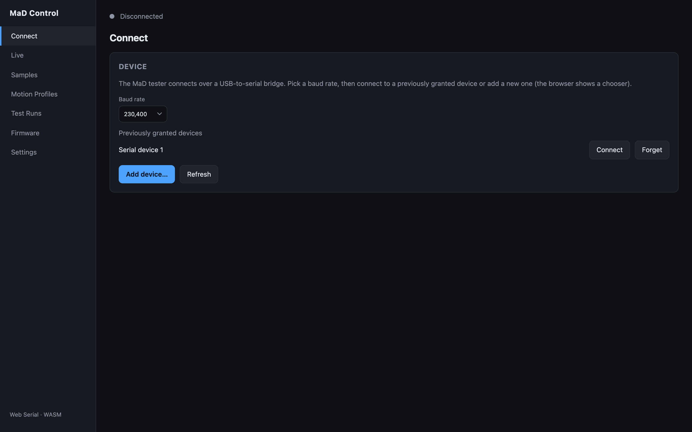

# Connecting

The **Connect** screen establishes the serial link between your browser and the
machine. The MaD tester presents itself as a USB-to-serial device.

## Connect to a machine

1. Power the machine on and plug it into your computer over USB.
2. Choose a **baud rate**. The default is **2,000,000**, which matches the firmware
   out of the box — only change this if your firmware is configured differently.
3. Connect:
    - If you've connected this device before, it appears in the **granted
      devices** list — click it to reconnect instantly.
    - Otherwise click **Connect device** (or **Add device…**). Your browser shows
      a native serial-port chooser; pick the machine's port and confirm.

When the link is up, the status bar turns green and shows **Connected**, the port
label, and the firmware version. A **Responding** badge appears once the firmware
starts streaming sample data:

## Granted devices & permissions

The browser remembers devices you've granted access to. The list comes from the
browser's own `navigator.serial.getPorts()`, so permissions persist across
reloads and survive in your browser profile. Use **Refresh** to re-scan and
**Add device…** to authorise a new one.

## Disconnecting & reconnecting

- **Disconnect** cleanly closes the port.
- If the link drops unexpectedly (USB unplugged, machine power-cycled), the
  status bar shows **Disconnected** with a **Reconnect** button that retries the
  last port and baud rate. When you replug the device, the app auto-reconnects.

!!! note "Responding vs. Connected"
    **Connected** means the serial port is open. **Responding** means the
    firmware is actually answering — sample data is flowing. If you see
    *Connected* but *Not responding*, the port opened but the firmware isn't
    talking; check power and baud rate, and see
    [Troubleshooting](troubleshooting.md).
