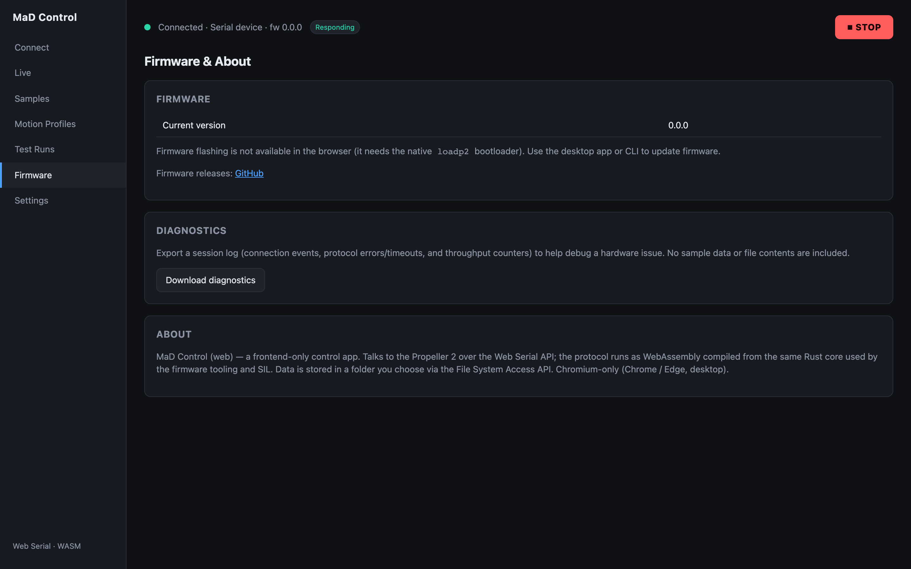

# Firmware & diagnostics

The **Firmware** screen shows the firmware version reported by the connected
machine, lets you update that firmware, and exports a diagnostics bundle for
troubleshooting.

## Firmware version

When the machine is connected and responding, its **firmware version** is shown
here (and in the status bar). If it shows nothing, the firmware isn't responding —
see [Troubleshooting](troubleshooting.md).

## Updating the firmware

!!! warning "New capability — validate before relying on it"
    Browser flashing is newly added and has been proven against unit tests and a
    reference implementation, but **not yet against a physical board**. Until it
    has been confirmed on your hardware, treat a flash as something to attempt
    with the machine on the bench and time to recover — not mid-session before a
    run. **Load into RAM** first: it is the reversible mode, and a power cycle
    undoes it.

The app programs the Propeller 2 over the same USB connection it uses for
control. There is nothing to install.

### What you need

- The **Debug/Programming header (J1)** connected — `GND / RESn / P63 / P62`,
  the standard Parallax 4-pin pinout.
- A USB-serial adapter that **drives RESn from DTR**, such as a Parallax Prop
  Plug. The app resets the chip that way to reach its boot ROM.

On production hardware the control link and the programming link are the same
connection, so if you can already talk to the machine, you can already program it.

!!! danger "The isolated Raspberry Pi link cannot program the board"
    The isolated link on P53/P55 has **no reset line**, so flashing over it will
    not work no matter what else is correct. Use the J1 header.

### Two modes

| Mode | What it does | When to use it |
|---|---|---|
| **Load into RAM** | Runs the firmware immediately. Lost at the next reset or power cycle. | Trying a build, or a first attempt — nothing is written permanently |
| **Write to flash** | Copies the firmware into the machine's flash. Survives power cycling. | The real update, once you're confident |

### Doing the update

1. **Connect to the machine** as usual, and note the version shown under
   **Current firmware** so you can confirm the change afterwards.
2. **Get the firmware file.** Releases are published on the project's GitHub
   releases page as `MaD-Firmware-<version>-release.bin`. There is also a
   `-debug` build, which moves the protocol link to different pins and is meant
   for bench work — for normal use, take the **release** file.
3. On the **Firmware** screen, choose **Load into RAM** or **Write to flash**.
4. Click **Choose file** and pick the `.bin`. The app shows its size and roughly
   how long the transfer will take — a few seconds for a typical image.
5. Click **Write to flash** / **Load into RAM**. The status line walks through
   *Resetting the board and waking its boot ROM…*, then *Uploading… n%*, then
   *Finishing…*.
6. When it completes, confirm the version under **Current firmware** is the one
   you just installed.

!!! tip "Bench setups with two adapters"
    **Choose a different port for programming** is only for setups where control
    and programming run over separate adapters — which happens with a debug
    firmware build, since that moves the protocol link to other pins. On
    production hardware, leave it unchecked. The browser can't tell two identical
    adapters apart, so if you do check it, you pick the port yourself.

### If it doesn't work

- **Nothing happens, or it fails while resetting** — the adapter probably isn't
  driving RESn from DTR, or you're on the isolated Raspberry Pi link. Check you're
  on J1 with a Prop Plug or equivalent.
- **It fails partway through the upload** — retry. If it keeps failing, power-cycle
  the machine and try **Load into RAM** first.
- **The version doesn't change after a flash** — the machine may have rebooted into
  the previous image. Power-cycle it, reconnect, and check again.

A failed **RAM** load changes nothing permanent: power-cycle and the machine comes
back on its existing firmware.

## Diagnostics export

Click **Download diagnostics** to save a file recording what the app has been
doing — connections, errors, timeouts, and rejected commands — plus some
performance counters. It contains **no test data**, so it's safe to attach when
reporting a problem.

!!! info "Updating the app"
    The app and the firmware update separately. When a new version of the **app**
    is published, the status bar shows an **Update ready** button. It is applied
    only when you click it **and** are idle and disconnected — the app will never
    reload itself mid-test.
