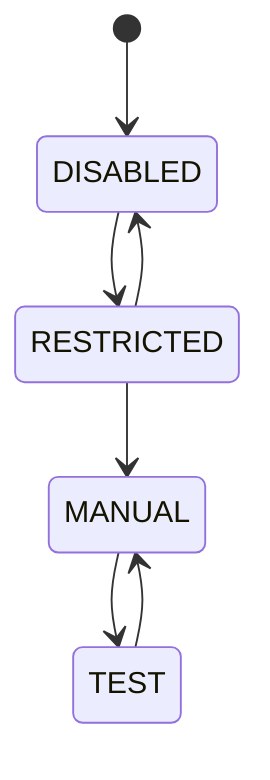

# States, faults & restrictions

The machine reports a state, and — when something is wrong — a fault or a
restriction. These appear as badges on the [Live](live-monitoring.md) screen.
This page explains what each one means.

The short version: a **fault** stops everything and usually needs a reboot; a
**restriction** just limits motion and clears itself once you fix the cause.

## States

| State | Meaning |
|---|---|
| **DISABLED** | Motion not enabled — the safe default |
| **RESTRICTED** | Motion enabled but limited by an active restriction |
| **MANUAL** | Free motion control from the app |
| **TEST** | Automated test execution from a motion profile |

## Faults

A fault **stays set until the machine is restarted**, and no motion is permitted
while one is showing. The badge shows the code in the first column below.

| Badge | What it means | What to do |
|---|---|---|
| `NONE` | No fault — normal | — |
| `COG` | One of the controller's processor cores stopped running | Reboot the machine. If it repeats, note what you were doing and open an issue |
| `WATCHDOG` | Part of the controller stopped responding and the machine shut itself down | Reboot the machine |
| `ESD_POWER` | Emergency-stop circuit lost power | Check the emergency-stop wiring and power, then reboot |
| `ESD_SWITCH` | Emergency-stop switch reported a fault | Check the switch is properly reset, then reboot |
| `ESD_UPPER` | Upper emergency-stop tripped | Clear whatever caused the trip, then reboot |
| `ESD_LOWER` | Lower emergency-stop tripped | Clear whatever caused the trip, then reboot |
| `SERVO_COMMUNICATION` | Lost contact with the motor controller | Check the motor wiring, then reboot |
| `FORCE_GAUGE_COMMUNICATION` | Lost contact with the force gauge | Check the force-gauge cable, then reboot |

## Restrictions

A restriction **limits motion while a condition holds**, and **clears by itself**
as soon as the cause goes away. No reboot needed — just resolve the cause.

| Badge | What it means | What to do |
|---|---|---|
| `NONE` | No restriction — normal | — |
| `SAMPLE_LENGTH` | The sample reached the maximum extension set in its profile | Jog back, or raise the limit in the [sample profile](sample-profiles.md) |
| `SAMPLE_TENSION` | The sample reached the maximum force set in its profile | Jog back, or raise the limit in the sample profile |
| `MACHINE_TENSION` | Force reached the machine's own protection limit | Jog back to relieve the load |
| `UPPER_ENDSTOP` | The jaw reached the top of its travel | Jog downward |
| `LOWER_ENDSTOP` | The jaw reached the bottom of its travel | Jog upward |
| `DOOR` | The door is open | Close the door |

## Where you'll see them

These show up as **State badges** on the [Live](live-monitoring.md) screen —
hover any badge for a short explanation without leaving the screen. There's also
a separate **Motion** badge that simply reports whether the machine is disabled,
waiting, or moving.

For the safety reasoning behind all this, see
[the machine](../how-it-works/the-machine.md#safety-model).
