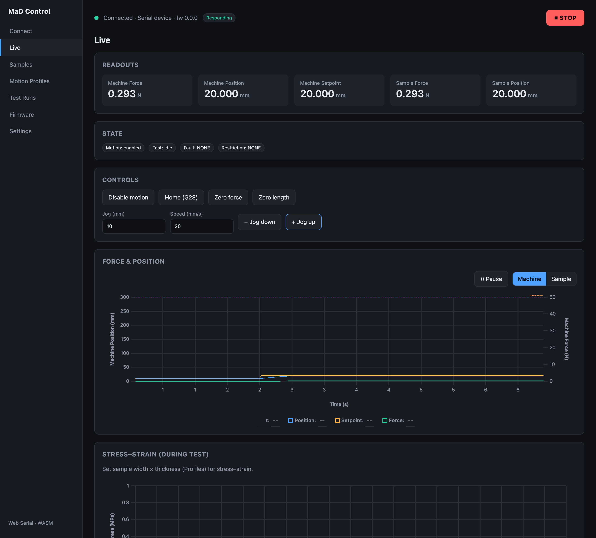

# Manual control

Manual motion controls live in the **Controls** card on the
[Live](live-monitoring.md) screen. Use them to position the gantry, home the
axis, and zero the force gauge and encoder before a test.

## Enable motion

Motion is gated for safety. Click **Enable motion** to allow the machine to move;
the **Motion** state badge switches to *enabled*. Click **Disable motion** to
stop allowing motion.

!!! warning
    Enabling motion only *permits* movement — it doesn't move anything by itself.
    Motion is still subject to the machine's restrictions (endstops, door
    interlock, tension limits). If a restriction is active, commands are limited
    or ignored until it clears.

## Jog

To move the gantry incrementally:

1. Set **Jog (mm)** — the distance to move.
2. Set **Speed (mm/s)** — the feed rate.
3. Click **+ Jog up** or **− Jog down**.

Invalid inputs (zero or non-numeric) are rejected with feedback, and any move
outside the machine's encodable range is blocked before it's sent.

## Home, Zero force, Zero length

| Button | Action |
|---|---|
| **Home (G28)** | Homes the motion axis to its reference. |
| **Zero force** | Zeroes the force-gauge reading at the current load — establishes the sample-force origin. |
| **Zero length** | Zeroes the position/encoder at the current position — establishes the gauge-length origin. |

Zeroing is how **sample coordinates** are defined: after zeroing, *Sample Force*
and *Sample Position* are measured relative to that point, which is what a test
records.

## During a test

Manual controls (jog, home, zero) are **disabled while a test is running** — the
machine is executing its motion profile autonomously and shouldn't be perturbed.
The global **STOP** control remains available; it disables motion immediately
(a software convenience, not the hardware e-stop).
