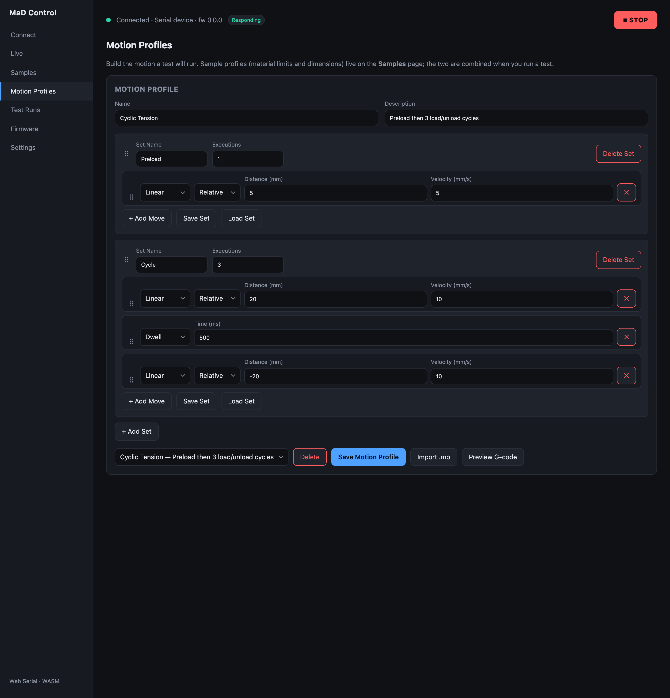
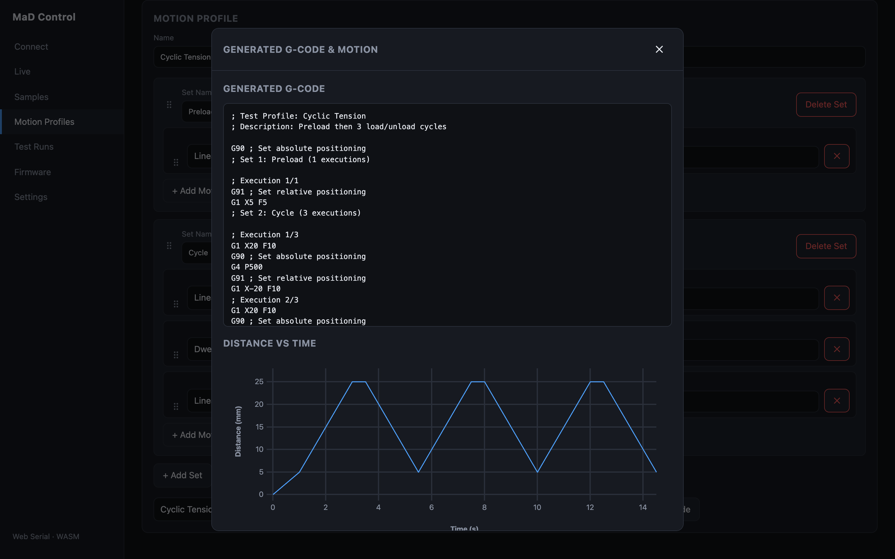

# Motion profiles

A **motion profile** defines what the machine *does* during a test — a sequence
of moves, grouped into repeatable **sets**. You build it on the **Motion
Profiles** screen.

## Structure

A motion profile has a **name** and **description**, and contains one or more
**sets**. Each set has:

- a **name**,
- an **executions** count (how many times the set repeats),
- and an ordered list of **moves**.

Both **sets** and **moves** are **drag-reorderable** (grab the handle on the
left). You can add and delete sets and moves freely.

## Move types

| Type | Parameters | What it does |
|---|---|---|
| **Linear** | position/distance + velocity | A controlled pull or return. *Absolute* uses a target position; *relative* uses a distance from the current position. |
| **Dwell** | time (ms) | Hold position for a fixed time. |
| **Waveform** | waveform (sine/triangle), amplitude, frequency, cycles, centre | A position-vs-time oscillation for cyclic / fatigue loading. |

Each move has an **absolute / relative** selector. For the **Waveform** move, the
app shows the live **peak velocity** and **duration** and warns if it exceeds the
velocity limit; it's expanded host-side into many small `G1` segments the firmware
plays back from its SD card, so it runs unattended with no firmware changes.

## Preview the G-code

Click **Preview G-code** to see exactly what will be sent to the machine, plus a
distance-vs-time chart of the motion:

The generated program uses standard codes (`G90`/`G91` for absolute/relative,
`G1` for linear moves, `G4` for dwell) and always ends with **`G122`** to signal
"test complete" to the firmware. See the [G-code reference](../reference/gcode.md).

## Saving, loading, importing

- **Save Motion Profile** stores it in your [data folder](settings-and-data.md);
  it then appears in the **Load saved profile…** dropdown.
- You can also **Save / Load individual Sets**, so a reusable set (e.g. a cyclic
  block) can be shared across profiles.
- **Import `.mp`** loads a profile from a JSON `.mp` file — see
  [file formats](../reference/file-formats.md).
