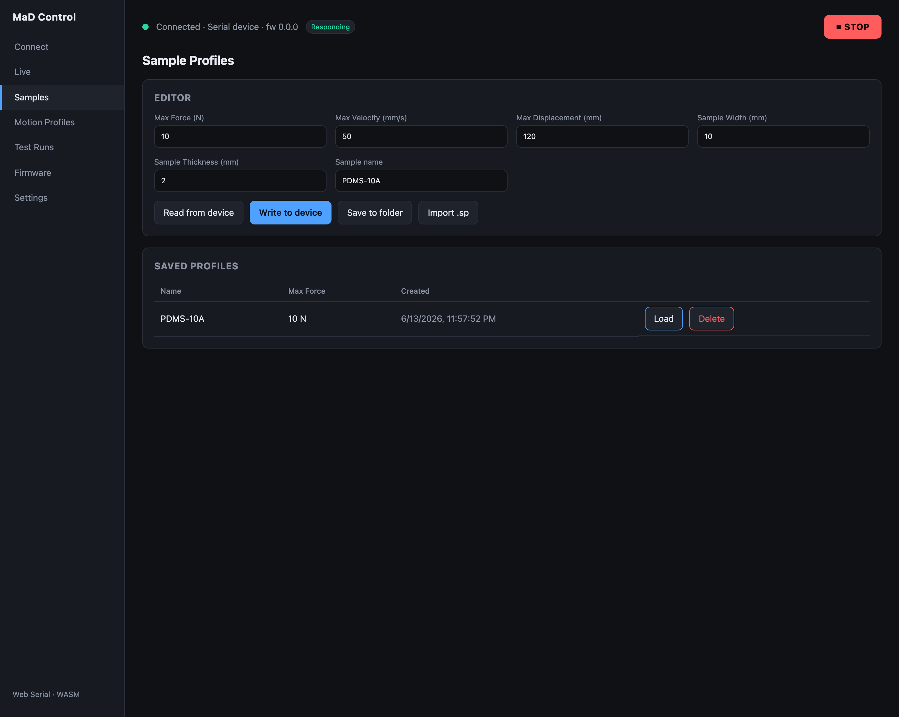

# Sample profiles

A **sample profile** describes the material you're testing: its dimensions and
the safety limits the machine must respect. You manage sample profiles on the
**Samples** screen.

A sample profile is one half of a test — the other half is a
[motion profile](motion-profiles.md). They're combined when you
[run a test](running-a-test.md).

## Fields

| Field | Unit | Meaning |
|---|---|---|
| **Max Force** | N | The test stops if sample force exceeds this |
| **Max Velocity** | mm/s | Velocity ceiling for moves in this test |
| **Max Displacement** | mm | The test stops if extension exceeds this |
| **Sample Width** | mm | Cross-section width — used for stress (σ = F / (w·t)) |
| **Sample Thickness** | mm | Cross-section thickness |
| **Serial / name** | — | An identifier for this sample/material |

!!! info "Limits are enforced by the firmware"
    Max Force and Max Displacement aren't just UI hints — the firmware **stops
    the running test** if the sample exceeds either, raising a warning
    notification. This protects both the sample and the machine.

The width and thickness define the cross-sectional area used to convert force
into **stress**, and the gauge length (captured at run time) converts extension
into **strain** — that's what produces the stress–strain curve in the
[run viewer](test-history-and-analysis.md).

## Saving, loading, importing

- **Save to folder** stores the profile in your [data folder](settings-and-data.md)
  so it's available later and appears in the load list.
- The list of saved profiles lets you **load** a profile back into the editor or
  **delete** it.
- **Import `.sp`** loads a profile from a JSON `.sp` file (interchangeable with
  saved profiles). See the [file formats reference](../reference/file-formats.md).
- When connected, you can **Write to device** to push the profile to the
  firmware, or **Read from device** to pull the currently-loaded one.
