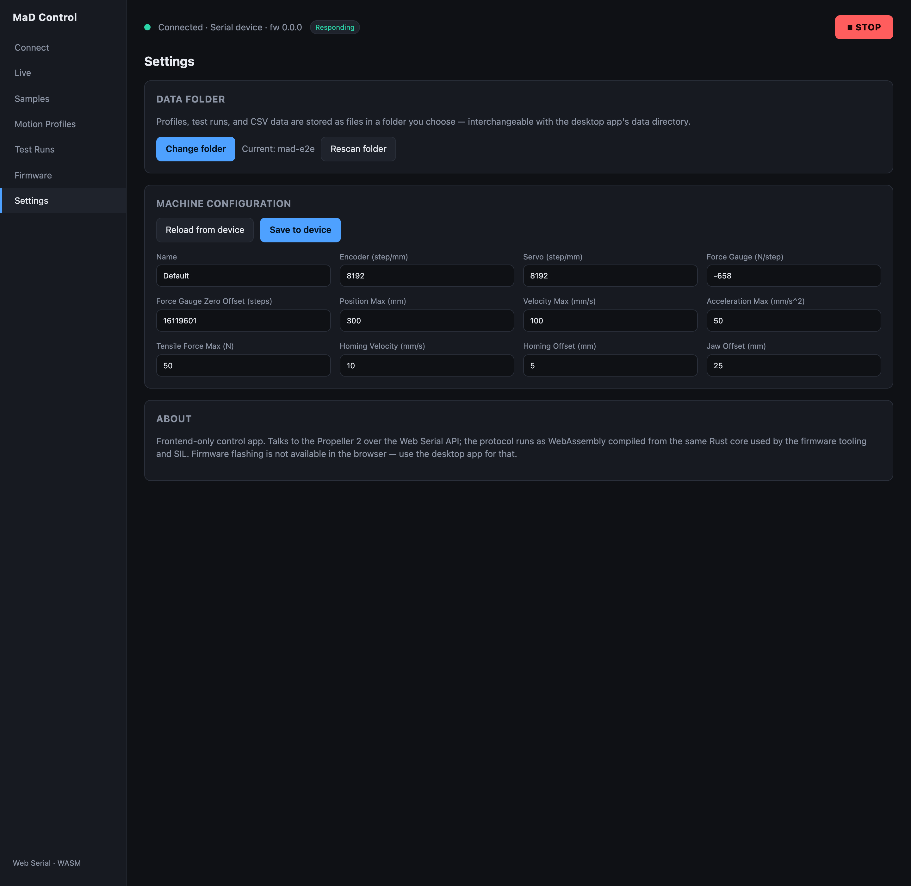

# Settings & data

The **Settings** screen is where you choose where the app stores your data, and
where you read/write the [machine configuration](machine-configuration.md).

## The data folder

The app saves sample profiles, motion profiles, sets, and test results to a
**folder on your computer** using the browser's File System Access API.

- Click **Choose folder** and pick (or create) a folder. The app remembers it
  across reloads — you grant access once.
- The current folder is shown as **Current: …**. Use **Change folder** to switch.
- If the browser needs you to re-confirm access after a restart, a **Grant
  access** prompt appears — click it.

### How data is organised

Inside the folder, the app keeps subfolders for `sampleProfiles/`,
`motionProfiles/`, `sets/`, and `testRuns/` (JSON records plus the CSV for each
run), and a small `index.json` cache. The layout mirrors the desktop app's, so
files are interchangeable.

!!! tip "Rescan folder"
    `index.json` is just a **rebuildable cache**. If runs don't show up after
    switching folders or editing files outside the app, click **Rescan folder** —
    it regenerates the index from the files on disk.

### Test naming

New runs are numbered automatically: the next name is one more than the highest
existing numeric name in the folder, so switching folders can't silently
overwrite earlier results.

!!! info "Why a browser can't 'open in Finder'"
    A web app can't open your OS file explorer or read arbitrary paths — it only
    has access to the folder you explicitly granted. That's a browser security
    boundary, not a missing feature.

## Machine configuration

The lower part of Settings reads and writes the machine's stored calibration and
limits — covered in [Machine configuration](machine-configuration.md).

## Storage persistence

When you choose a folder the app also requests persistent storage so the browser
won't evict your data. Storage-related errors (a denied grant, a failed save) are
surfaced as toasts.
