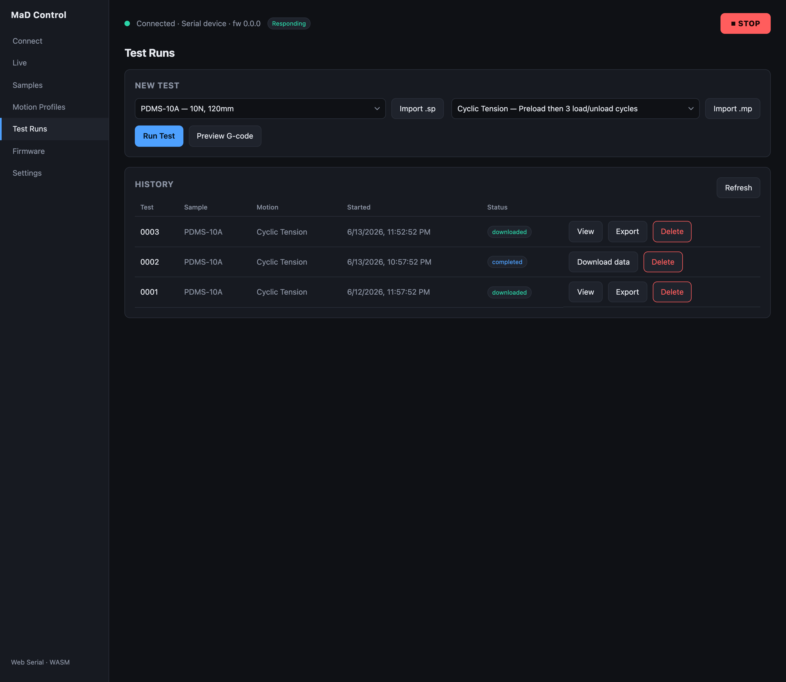
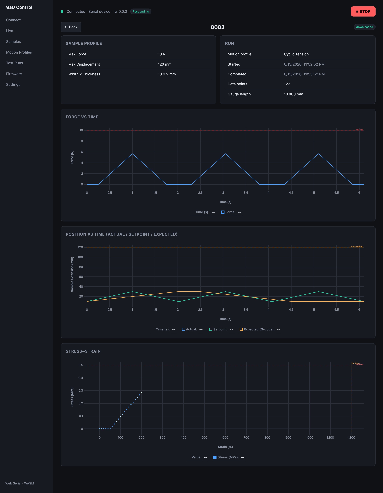

# Test history & analysis

Every run is recorded in the **History** table on the **Test Runs** screen, and
each finished run can be opened in the **run viewer** for analysis.

## The history table

Each row shows the test name, the **sample** and **motion** profile names, the
start time, and a **status** badge:

| Status | Meaning |
|---|---|
| `running` | The test is in progress |
| `completed` | The motion finished; data is on the machine but not yet downloaded |
| `downloaded` | The CSV has been pulled to your data folder and can be viewed |
| `error` | The run was interrupted (e.g. the link dropped mid-test) |

Row actions:

- **Download data** — pull the recorded CSV off the machine (a progress bar shows
  transfer). Status becomes *downloaded*.
- **View** — open the run viewer (available once downloaded).
- **Export** — save the CSV (with a metadata header) to a file.
- **Delete** — remove the run (with a confirmation dialog).
- **Mark done / Mark failed** — resolve a run stuck in *running*.

Use **Refresh** to reload the table, and **load older runs** to page through
history.

## The run viewer

Click **View** to open the analysis for a run:

It shows:

- **Info cards** — the sample-profile details and run details (motion profile,
  start/complete times, number of data points, gauge length).
- **Force vs Time** — the recorded force with a **Max Force** reference line.
- **Position vs Time** — where the jaw **actually** went, what the machine was
  **commanding**, and what the motion profile **expected**, with a
  **Max Displacement** reference line. Divergence between the three is the
  quickest way to spot a slipping grip or a limit being hit.
- **Stress–strain** — stress (σ = |F| / (width·thickness), MPa) against strain
  (ΔL / gauge length, %), with **Max Stress / Max Strain** limit lines.

## The data

Results are stored as **CSV** in your [data folder](settings-and-data.md), so you
can open them in a spreadsheet or analysis tool. The run viewer and the **Export**
action both show values in the usual units (N and mm); the raw CSV records them in
finer units, so expect larger numbers if you open the file directly.
[File formats](file-formats.md) has the exact column layout.
